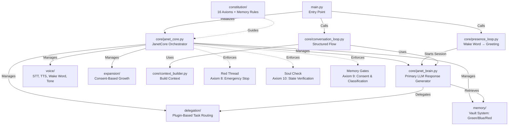
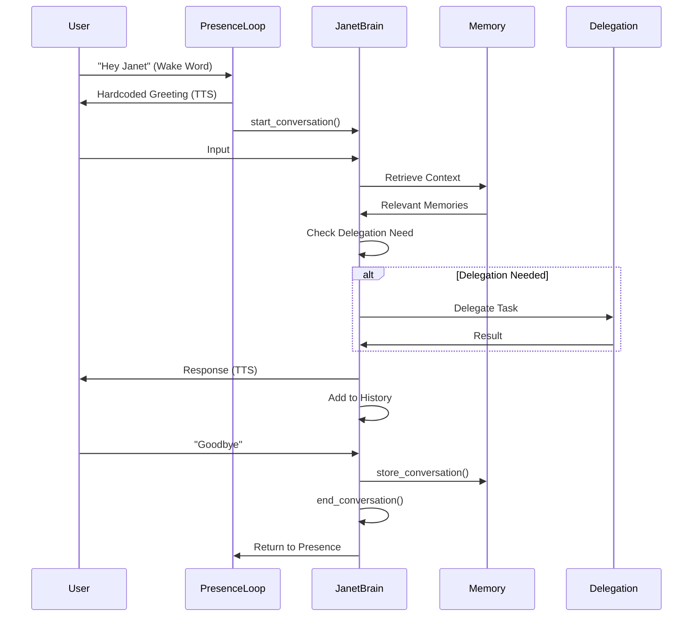
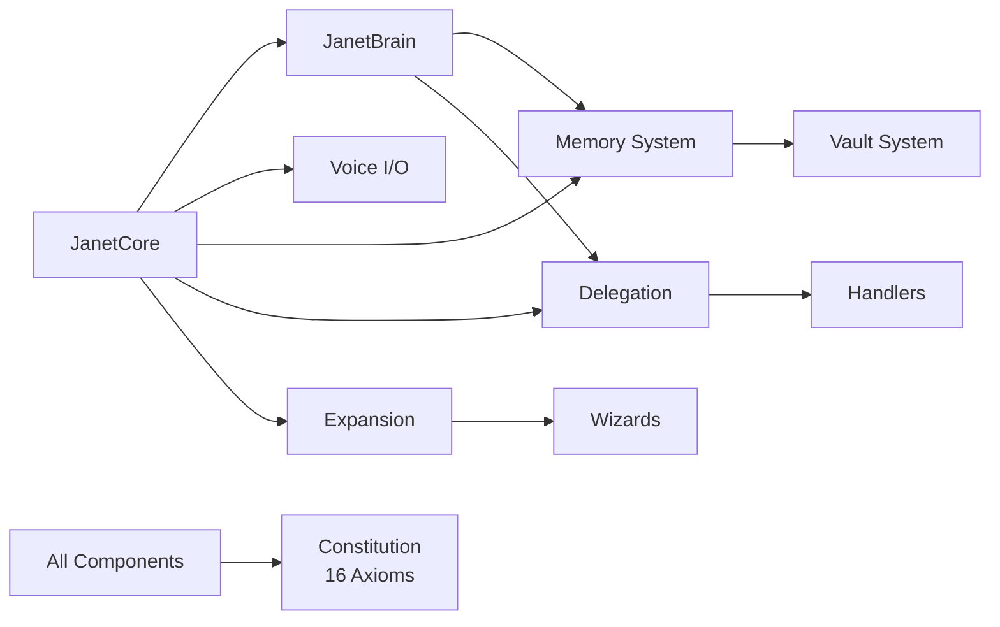

# 🌱 J.A.N.E.T. Seed

**Just A Neat Evolving Thinker — Seed Edition**

J.A.N.E.T. Seed is the constitutional, offline-first seed of a personal AI companion designed to think with you — not over you.

This repository contains the core system only:

- Janet's identity
- Her constitutional axioms
- Her memory rules
- Her presence and conversation loops
- Her consent-first delegation model

J.A.N.E.T. Seed is intentionally small, honest, and grounded.

## ✨ What J.A.N.E.T. Seed Is

- 🧠 A constitutional AI core, not a chatbot
- 🔐 Offline-first and private by design
- 🌱 Designed to grow only with consent
- 🧭 Grounded, interruptible, and human-centered

## 🚫 What J.A.N.E.T. Seed Is Not

- Not a cloud service
- Not autonomous without oversight
- Not self-expanding
- Not a general-purpose AGI

## 🧬 Core Principles

- **Constitution first** — 16 immutable axioms guide all behavior
- **Presence before cognition** — Janet listens only when invited
- **Consent over capability** — nothing expands unless you say yes
- **Memory with restraint** — secrets are sacred, not data

> "This is what I can be here.  
> This is what I could become elsewhere.  
> Nothing happens unless you say yes."

## 🏗️ Architecture Overview

### System Architecture



All enforced by Janet's constitution.

### Conversation Session Lifecycle



## 🚀 Getting Started

```bash
python3 src/main.py
```

**Optional modes:**

```bash
python3 src/main.py --voice
python3 src/main.py --detect-only
python3 src/main.py --verify
```

## 📚 Repository Structure

### Core Modules

- **[`src/core/`](src/core/README.md)** — Janet's sacred cognitive core
  - `janet_core.py` - Main orchestrator with constitutional enforcement
  - `janet_brain.py` - Primary LLM response generator with conversation context
  - `presence_loop.py` - Wake word detection and greeting
  - `conversation_loop.py` - Structured conversation flow
  - `context_builder.py` - Build conversation context

- **[`src/voice/`](src/voice/README.md)** — Voice I/O system
  - `stt.py` - Speech-to-text using Whisper
  - `tts.py` - Text-to-speech synthesis
  - `wake_word.py` - Wake word detection ("Hey Janet")
  - `tone_awareness.py` - Emotional tone analysis

- **[`src/memory/`](src/memory/README.md)** — Memory vault system
  - `memory_manager.py` - Unified memory interface
  - `green_vault.py` - Safe summary storage (SQLite + ChromaDB)
  - `blue_vault.py` - Ephemeral secrets (in-memory, zeroized on lock)
  - `red_vault.py` - Encrypted secrets at rest (Fernet encryption)
  - `classification.py` - Conversation classification
  - `distillation.py` - Safe summary distillation
  - `learning_manager.py` - Learning system (Green Vault only)

- **[`src/delegation/`](src/delegation/README.md)** — Plugin-based delegation system
  - `delegation_manager.py` - Main orchestrator with handler registry
  - `litellm_router.py` - LLM model routing
  - `n8n_client.py` - n8n webhook client
  - `home_assistant.py` - Home Assistant REST client
  - [`handlers/`](src/delegation/handlers/README.md) - Delegation handlers
    - `base.py` - Handler interface
    - `image_handler.py` - Image processing
    - `home_automation_handler.py` - Smart home control
    - `n8n_handler.py` - n8n workflow routing

- **[`src/expansion/`](src/expansion/README.md)** — Consent-based expansion protocol
  - `expansion_detector.py` - Detect expansion opportunities
  - `expansion_dialog.py` - Proactive suggestion system
  - `expansion_state.py` - State management with consent records
  - `model_manager.py` - Offline-first model installation guidance
  - [`wizards/`](src/expansion/wizards/README.md) - Expansion wizards
    - `wizard_base.py` - Base wizard class
    - `voice_wizard.py` - Voice I/O setup
    - `memory_wizard.py` - Memory system setup
    - `model_wizard.py` - Model installation (offline-first)
    - `learning_wizard.py` - Learning system setup

### Supporting Modules

- **[`constitution/`](constitution/README.md)** — Constitutional system
  - `AXIOMS.md` - The 16 immutable axioms
  - `MEMORY_CONSTITUTION.md` - Memory storage and protection principles
  - `protocols.md` - Detailed procedural guides
  - `personality.json` - Janet's identity and preferences

- **[`tests/`](tests/README.md)** — Test suite
  - Unit tests for all major components
  - Integration tests for end-to-end flows
  - Constitutional compliance tests

## 🌱 Growth

J.A.N.E.T. Seed can remain small forever — or grow carefully.

**Expansion Protocol (Day 5)**: Janet can detect and suggest expansion opportunities based on your hardware. All expansions require explicit consent and work offline-first. Ask `what can you do?` to see available expansions.

See [CAPABILITIES.md](CAPABILITIES.md) and [documentation/EXPANSION_GUIDE.md](documentation/EXPANSION_GUIDE.md) to understand how expansion works.

## 📖 Documentation

### User Documentation

- **[User Guide](documentation/USER_GUIDE.md)** — Complete guide for using J.A.N.E.T. Seed
- **[Expansion Guide](documentation/EXPANSION_GUIDE.md)** — How to expand Janet's capabilities
- **[Offline Installation](documentation/OFFLINE_INSTALLATION.md)** — Installing models offline

### Developer Documentation

- **[Core System](src/core/README.md)** — Core architecture and conversation management
- **[Voice System](src/voice/README.md)** — Voice I/O components and flow
- **[Memory System](src/memory/README.md)** — Memory vault architecture and learning system
- **[Delegation System](src/delegation/README.md)** — Plugin-based task delegation
- **[Delegation Handlers](src/delegation/handlers/README.md)** — Handler architecture
- **[Expansion Protocol](src/expansion/README.md)** — Consent-based expansion system
- **[Expansion Wizards](src/expansion/wizards/README.md)** — Wizard system guide
- **[Constitutional System](constitution/README.md)** — Axioms and memory constitution
- **[Test Suite](tests/README.md)** — Testing documentation

### Technical Documentation

- **[Axiom Implementation](documentation/AXIOM_IMPLEMENTATION.md)** — Technical details on constitutional axioms
- **[Build Order](documentation/BUILD_ORDER.md)** — Development timeline and milestones
- **[Contributing](documentation/CONTRIBUTING.md)** — Contribution guidelines
- **[API Reference](API_REFERENCE.md)** — OpenAI-compatible API documentation

### IDE Integration

- **[📚 Documentation Index](JANET_IDE_INDEX.md)** — **START HERE** - Complete guide to all IDE docs
- **[⚡ Quick Start](QUICK_START_IDE.md)** — Get running in 5 minutes
- **[📖 Complete Guide](JANET_IDE_COMPLETE_GUIDE.md)** — Master documentation (everything in one place)
- **[🔧 Setup Guide](JANET_IDE_SETUP.md)** — Detailed installation and configuration
- **[📡 API Reference](API_REFERENCE.md)** — Complete API documentation
- **[📊 Implementation Summary](IMPLEMENTATION_SUMMARY.md)** — Technical overview
- **[API Server](janet_api_server.py)** — OpenAI-compatible HTTP API server
- **[API Tests](test_janet_api.py)** — API testing and verification
- **[Continue.dev Config](~/.continue/config.yaml)** — VSCode extension configuration

## 🖥️ IDE Integration (New!)

**Use Janet as your AI coding assistant in VSCode!**

Janet now includes an OpenAI-compatible API server that works with Continue.dev to provide:
- 💬 **Chat Interface** (Cmd+L) - Conversational coding assistance
- ✏️ **Inline Editing** (Cmd+K) - AI-powered code modifications  
- ⚡ **Autocomplete** - Real-time code suggestions
- 🔍 **Codebase Context** - Semantic search with @-mentions

### Quick Start

```bash
# 1. Start Janet API server
./start_janet_api.sh

# 2. Install Continue.dev extension in VSCode
# 3. Configuration is already set up at ~/.continue/config.yaml
# 4. Start coding with Janet!
```

**Features:**
- ✅ Offline-first - All processing local, no cloud
- ✅ Privacy-first - Your code never leaves your machine
- ✅ Constitutional AI - Follows 16 axioms
- ✅ Multi-model support - Fast/balanced/powerful models

**See [JANET_IDE_SETUP.md](JANET_IDE_SETUP.md) for complete setup instructions.**

## 🔧 Developer Quick Start

### Understanding the Codebase

1. **Start with the Core**: Read [`src/core/README.md`](src/core/README.md) to understand the main orchestrator
2. **Explore Subsystems**: Each module has its own README with flow diagrams
3. **Study the Constitution**: Read [`constitution/README.md`](constitution/README.md) to understand the principles
4. **Review Tests**: Check [`tests/README.md`](tests/README.md) to see how components are tested

### Key Entry Points

- `src/main.py` - Application entry point
- `src/core/janet_core.py` - Main orchestrator class
- `src/core/janet_brain.py` - Primary LLM response generator
- `constitution/AXIOMS.md` - The 16 immutable axioms

### Component Relationships



## 📜 License

MIT — use freely, extend kindly, share openly.
