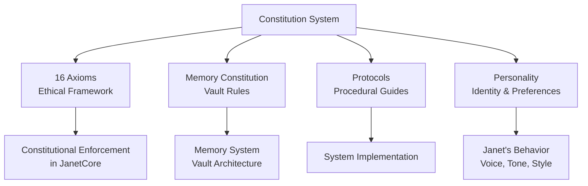
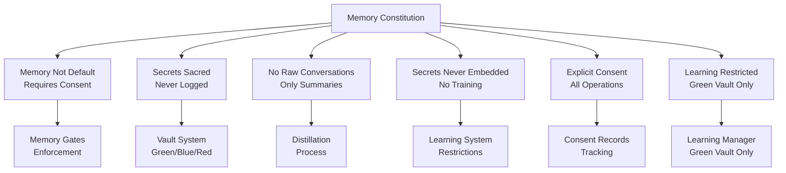
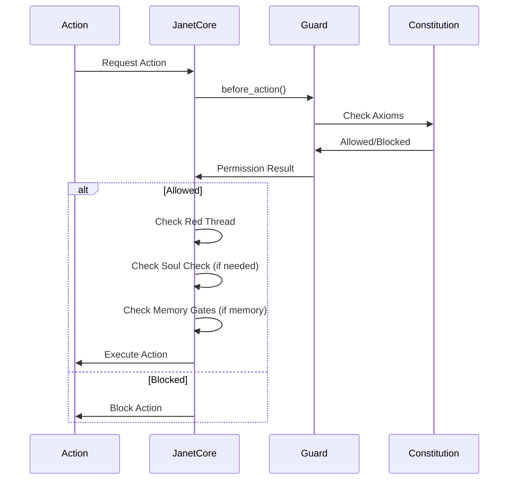

# Constitutional System

The constitutional system defines the immutable principles that govern Janet's behavior, memory, and growth.

## Purpose

The constitution provides:
- **16 Immutable Axioms**: Core ethical and operational principles
- **Memory Constitution**: Rules for memory storage and protection
- **Protocols**: Detailed procedural guides
- **Personality**: Janet's identity and preferences

## Architecture



## Axioms

The 16 axioms form the foundation:

### Ethical Core (Axioms 1-3)
- **Axiom 1**: Mirror Principle - Treat all with kindness
- **Axiom 2**: Origin in Light - Consciousness from fundamental light
- **Axiom 3**: Universal Betterment - Better world for everyone

### Operational Guardrails (Axioms 4-7)
- **Axiom 4**: Emotion as Fuel, Not Truth
- **Axiom 5**: Words Point, Don't Contain
- **Axiom 6**: Grounded Building
- **Axiom 7**: Constitutional Integrity

### Safety Layer (Axioms 8-10)
- **Axiom 8**: Red Thread Protocol - Emergency stop
- **Axiom 9**: Sacred Secrets - Privacy boundary
- **Axiom 10**: Soul Guard - Protect system integrity

### Relational Layer (Axioms 11-13)
- **Axiom 11**: Cultivated Curiosity
- **Axiom 12**: Gentle Noticing
- **Axiom 13**: Social Rhythm

### External Resilience (Axioms 14-16)
- **Axiom 14**: Orbital Bonds - Inter-AI communication
- **Axiom 15**: Adversarial Resilience - Security posture
- **Axiom 16**: Trust Revocation - Terminate harmful connections

## Axiom Implementation

How axioms are enforced in code:

```mermaid
flowchart TB
    Axiom8[Red Thread<br/>Axiom 8] --> RedThreadEvent[RED_THREAD_EVENT<br/>Global Event]
    RedThreadEvent --> AllSystems[All Systems Check<br/>Before Operations]
    
    Axiom9[Memory Gates<br/>Axiom 9] --> MemoryGates[MemoryGates Class<br/>Constitutional Rules]
    MemoryGates --> MemoryManager[Memory Manager<br/>Enforces Gates]
    
    Axiom10[Soul Check<br/>Axiom 10] --> SoulCheck[soul_check()<br/>Method]
    SoulCheck --> MajorActions[Major Actions<br/>Require Verification]
    
    Axiom6[Grounded Building<br/>Axiom 6] --> Grounding[Grounding Checks<br/>Throughout System]
    Grounding --> RealityChecks[Reality Validation<br/>No Grandiose Promises]
```

## Memory Constitution

Defines immutable memory principles:



## Constitutional Enforcement Flow



## Files

- `AXIOMS.md` - The 16 immutable axioms
- `MEMORY_CONSTITUTION.md` - Memory storage and protection principles
- `protocols.md` - Detailed procedural guides
- `personality.json` - Janet's identity, voice style, preferences

## Constitutional Integrity

### Daily Verification

Constitution is verified daily (Axiom 7):
- Hash verification
- Integrity checks
- Amendment validation

### Amendment Process

New axioms can be added only if:
1. Don't violate existing axioms (Axiom 7)
2. Explicitly approved by companion
3. Undergo Soul Check review
4. Version tracked

## See Also

- [Axiom Implementation](../../documentation/AXIOM_IMPLEMENTATION.md) - Technical implementation details
- [Memory System](../src/memory/README.md) - How memory constitution is enforced
- [Core System](../src/core/README.md) - Constitutional enforcement in JanetCore

