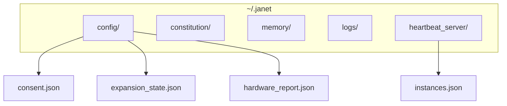

# JANET Files — Main Documentation

Canonical reference for (1) Janet source files (`.janet`) and (2) the `~/.janet` directory.

---

## Overview

The term "`.janet`" refers to two distinct things:

1. **Janet source files** — Source code in the [Janet programming language](https://janet-lang.org) (Lisp-like, used mainly in janet-max)
2. **`~/.janet` directory** — Runtime data and configuration for janet-seed and related components

This document covers both.

---

## Janet Source Files (.janet)

### Where They Live

Janet source files live primarily in the **janet-max** integration hub.

### janet-max Layout

| Path | Purpose |
|------|---------|
| `src/exo-main.janet` | Exo Runtime entry point (recommended) |
| `src/main.janet` | Legacy single-node entry point |
| `src/core/` | `hub.janet`, `config.janet`, `event-bus.janet`, `automation.janet` |
| `src/modules/` | Integration modules: `home-assistant.janet`, `n8n.janet`, `ability-bridge.janet`, `pinchtab.janet`, `figma.janet`, `exo.janet`, `apple-intelligence.janet`, `convertx.janet` |
| `src/api/` | `server.janet`, `routes.janet`, `middleware.janet`, `automation-routes.janet` |
| `config/default.janet` | Default configuration (struct: `:port`, `:api-key`, `:home-assistant-url`, etc.) |
| `config/secrets.janet` | Secrets (not committed; copy from `secrets.janet.example`) |
| `project.janet` | jpm project definition |

### Module Conventions

- Create new modules in `src/modules/my-module.janet`
- Register the module in `src/core/hub.janet`
- Load the module in `src/exo/runtime.janet` (Exo entry point)

### Running janet-max

```bash
janet src/exo-main.janet
```

### References

- [janet-max Developer Guide](../../../janet-max/docs/DEVELOPER_GUIDE.md) — `Janet-Projects/janet-max/docs/`
- [janet-max Comprehensive Guide](../../../janet-max/docs/COMPREHENSIVE_GUIDE.md)
- [janet-max docs/INDEX.md](../../../janet-max/docs/INDEX.md)

---

## ~/.janet Directory

### Purpose

The `~/.janet` directory is the runtime data and configuration home for janet-seed. It is controlled by the `JANET_HOME` environment variable (default: `~/.janet`).

### Structure



### Paths

| Path | Contents |
|------|----------|
| `config/` | `consent.json`, `expansion_state.json`, `hardware_report.json` |
| `constitution/` | Constitution files |
| `memory/` | Memory storage (Green/Blue/Red vaults) |
| `logs/` | Log files |
| `heartbeat_server/` | `instances.json` (Janet Health) |

### Optional / Extension Files

Some extensions store files under `~/.janet`:

| File | Component | Purpose |
|------|-----------|---------|
| `nas_media_consent.json` | JanetXNAS | NAS media storage consent |
| `janet-media-pi.env` | Janet-RaspberryPi | Pi-friendly environment variables |

### Reference

- [janet-seed User Guide — Configuration Files](USER_GUIDE.md#configuration-files)

---

## Cross-References

| Component | .janet Source | ~/.janet Usage |
|-----------|---------------|----------------|
| janet-seed | — | Owns layout: `config/`, `constitution/`, `memory/`, `logs/`, `heartbeat_server/` |
| janet-max | All `.janet` modules | — |
| JanetXNAS | — | `nas_media_consent.json` |
| JanetMedia | — | Optional NAS consent path |
| Janet-RaspberryPi | — | `janet-media-pi.env` |
