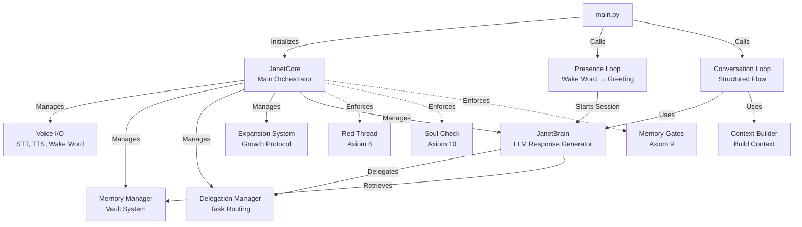
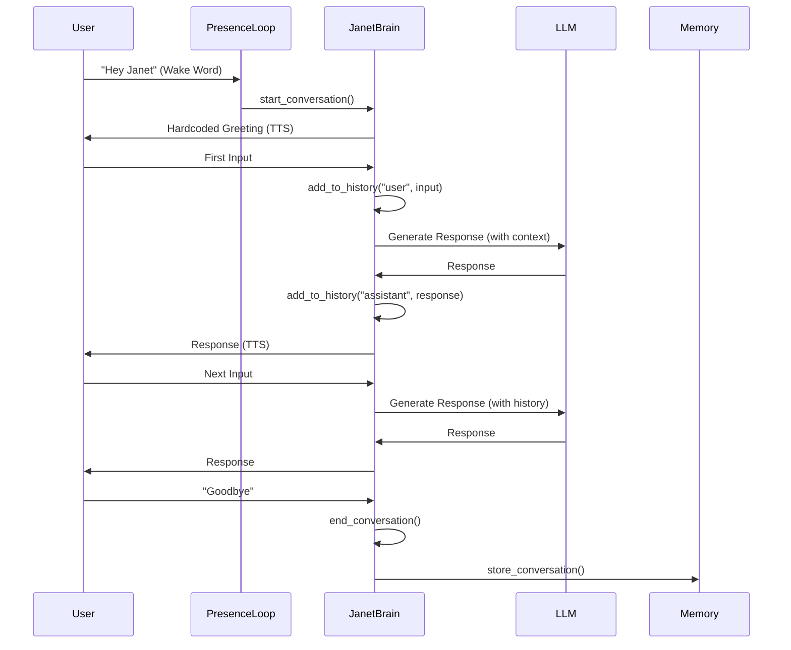
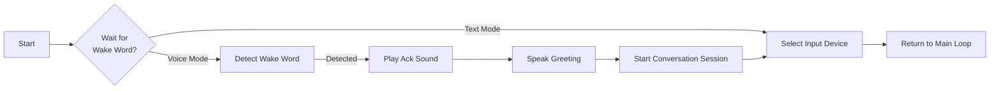
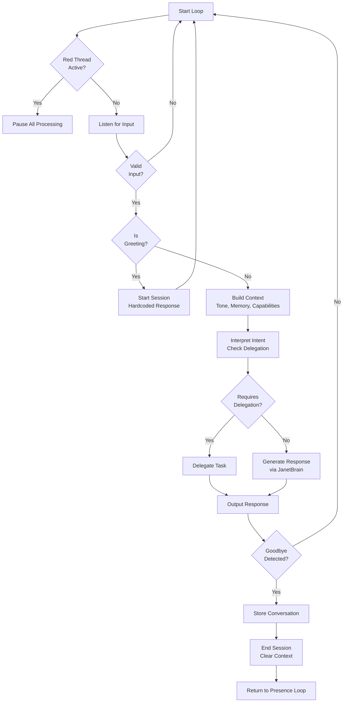

# Core System Architecture

The core system is Janet's sacred cognitive center - the orchestrator that coordinates all subsystems while enforcing constitutional principles.

## Purpose

The core system provides:
- **JanetCore**: Main orchestrator class that initializes and coordinates all subsystems
- **JanetBrain**: Primary LLM response generator with conversation context management
- **Presence Loop**: Wake word detection, greeting, and device selection
- **Conversation Loop**: Structured conversation flow with intent interpretation
- **Context Builder**: Builds conversation context from memory, tone, and capabilities

## Architecture



## Key Components

### JanetCore

The main orchestrator class that:
- Initializes all subsystems (voice, memory, delegation, expansion)
- Enforces constitutional axioms (Red Thread, Soul Check, Memory Gates)
- Coordinates between subsystems
- Manages conversation state

**Key Methods:**
- `invoke_red_thread()` - Emergency stop (Axiom 8)
- `soul_check()` - Verify companion state (Axiom 10)
- `memory_write_allowed()` - Check memory gates (Axiom 9)
- `converse()` - Handle normal conversation
- `interpret_intent()` - Determine if delegation is needed

### JanetBrain

The primary LLM response generator that:
- Manages conversation sessions with context windows
- Generates responses using Ollama models
- Detects when delegation is needed
- Maintains conversation history (sliding window, max 20 messages)

**Key Methods:**
- `start_conversation()` - Initialize new conversation session
- `end_conversation()` - Clear context window
- `generate_response()` - Generate LLM response with context
- `add_to_history()` - Track conversation history

**Conversation Session Flow:**



### Presence Loop

Handles the initial interaction:
1. Waits for wake word (or proceeds in text mode)
2. Plays acknowledgment sound
3. Speaks greeting (hardcoded, no LLM)
4. Starts conversation session
5. Selects input device (voice or text)

**Flow:**



### Conversation Loop

Structured conversation flow:
1. Check Red Thread (bypasses all processing)
2. Listen for input (voice or text)
3. Detect "Hi Janet" greetings (start new session)
4. Build context (tone, memory, capabilities)
5. Interpret intent (check for delegation)
6. Generate response (via JanetBrain or delegation)
7. Output response (text or TTS)
8. Store conversation on goodbye
9. Clear context window

**Flow:**



### Context Builder

Builds conversation context from:
- **Tone Analysis**: Emotional state, sentiment
- **Memory Context**: Relevant past conversations (Green Vault)
- **Delegation Capabilities**: Available handlers and integrations
- **Input Device**: Voice or text mode
- **Timestamp**: Conversation timing

## Constitutional Integration

### Red Thread Protocol (Axiom 8)

The Red Thread is a global emergency stop that:
- Immediately stops all subsystems
- Cannot be bypassed
- Requires explicit reset confirmation
- Checked at the start of every conversation loop iteration

**Implementation:**
- Global `RED_THREAD_EVENT` threading event
- All subsystems check this event before operations
- `invoke_red_thread()` sets the event and stops all subsystems
- `reset_red_thread()` requires explicit user confirmation

### Soul Check Protocol (Axiom 10)

Verifies companion state before significant actions:
- Collects user responses (clear-minded, emotional charge, future rating)
- Evaluates responses for concerns
- Suggests pause if concerns detected
- Allows override with explicit confirmation

**Triggered Before:**
- Major memory deletions
- Expansion wizards
- Constitutional changes
- Other high-stakes operations

### Memory Gates (Axiom 9)

Controls when memory writes are allowed:
- Checks Red Thread status
- Validates memory gates (constitutional rules)
- Classifies input (discard, normal, sensitive, secret)
- Routes to appropriate vault

## Usage

### Initialization

```python
from core import JanetCore
from constitution_loader import ConstitutionalGuard

guard = ConstitutionalGuard(constitution_path)
janet = JanetCore(
    constitution_path=constitution_path,
    guard=guard,
    voice_mode=True,
    memory_dir=memory_dir,
    config_path=config_path,
    hardware_profile=hardware_profile
)
```

### Running Loops

```python
from core import run_presence_loop, run_conversation_loop

# Main loop
while True:
    input_device = run_presence_loop(janet, voice_mode)
    result = run_conversation_loop(janet, input_device, voice_mode)
    
    if result == "quit":
        break
```

## Dependencies

- `constitution_loader` - Constitutional system
- `voice` - Voice I/O (optional)
- `memory` - Memory vault system (optional)
- `delegation` - Task delegation (optional)
- `expansion` - Expansion protocol (optional)
- `litellm` - LLM routing (for JanetBrain)

## Files

- `janet_core.py` - Main orchestrator class
- `janet_brain.py` - Primary LLM response generator
- `presence_loop.py` - Wake word and greeting handling
- `conversation_loop.py` - Structured conversation flow
- `context_builder.py` - Context construction
- `presence/safeword.py` - SafeWord controller for memory vaults

## See Also

- [Memory System](../memory/README.md) - Memory vault architecture
- [Voice System](../voice/README.md) - Voice I/O components
- [Delegation System](../delegation/README.md) - Task delegation
- [Expansion Protocol](../expansion/README.md) - Growth system

