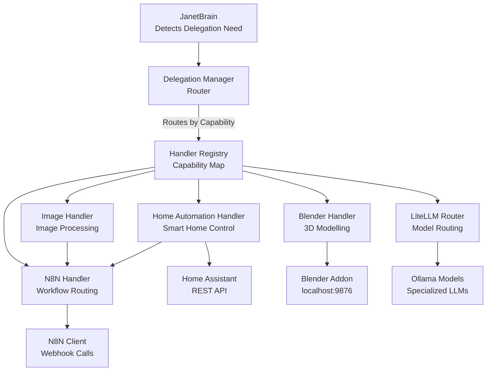
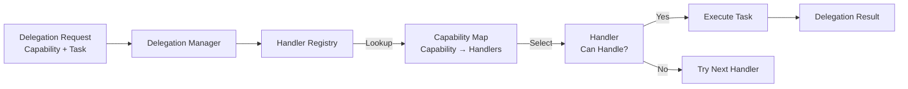
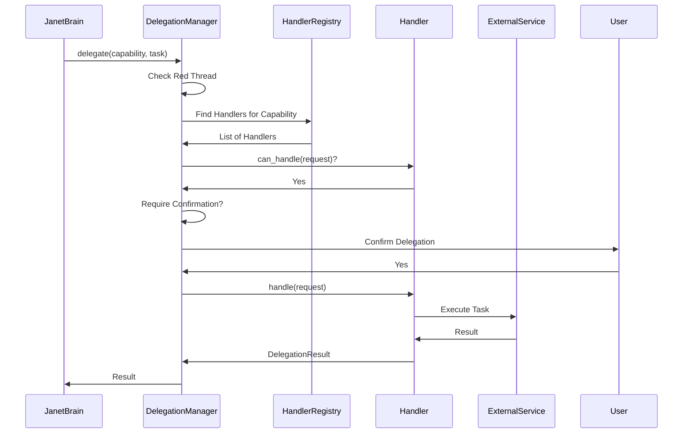
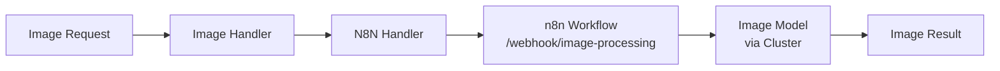
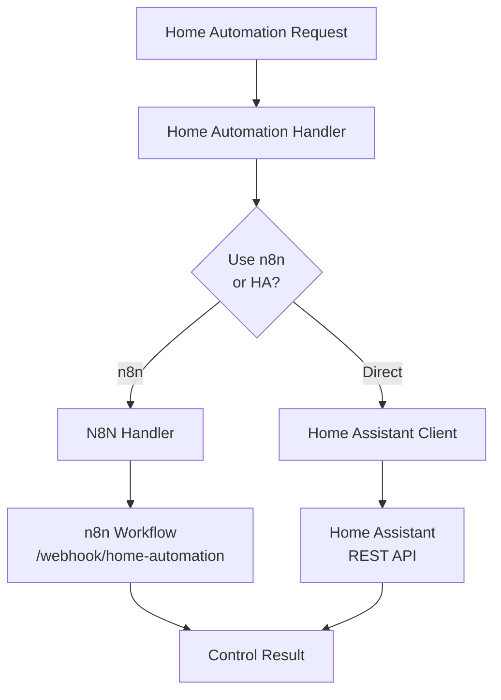
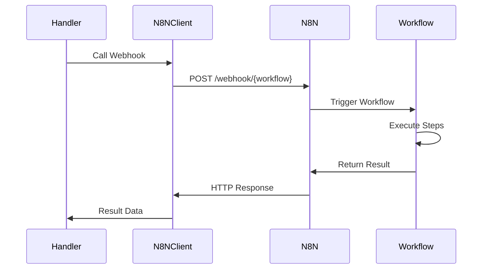
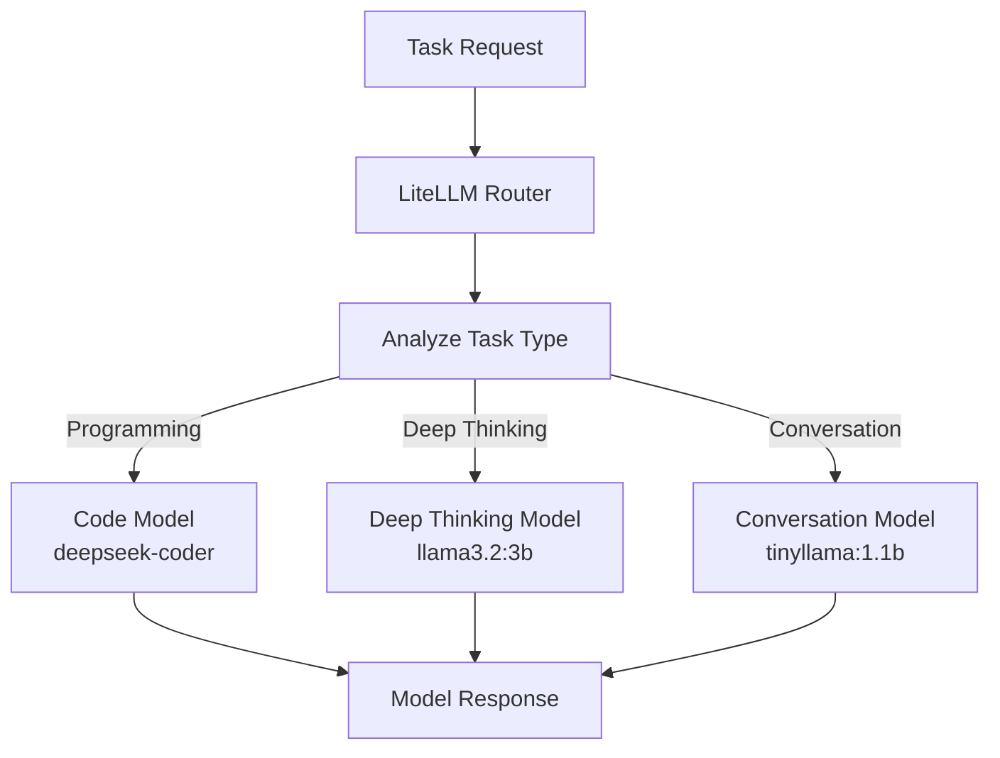
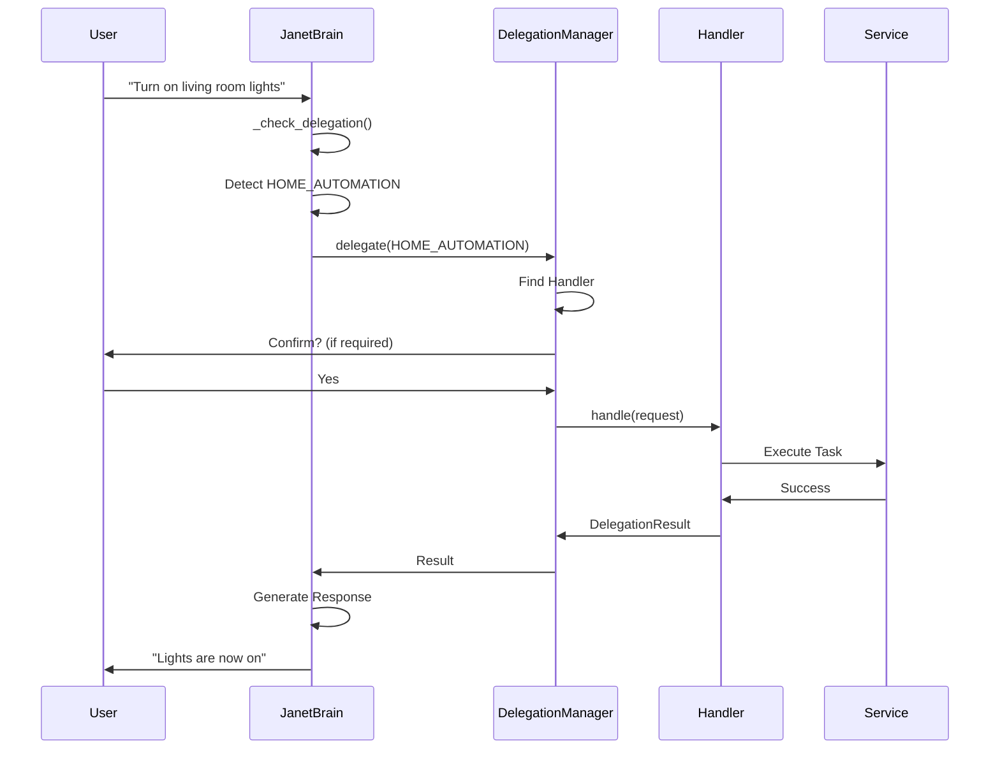
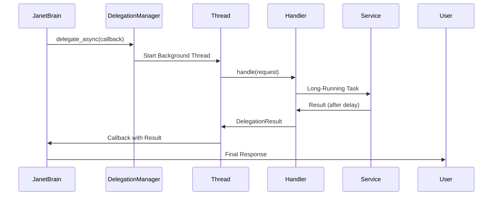

# Delegation System Architecture

The delegation system provides a plugin-based architecture for routing tasks to specialized models, automation tools, and external services.

## Purpose

The delegation system enables:
- **Model Routing**: Route tasks to specialized LLMs (programming, deep thinking)
- **Image Processing**: Handle image analysis and generation via n8n
- **Home Automation**: Control smart home devices via n8n or Home Assistant
- **3D Modelling**: Control Blender via MCP addon (create objects, execute Python in Blender)
- **Extensible Handlers**: Plugin-based architecture for adding new capabilities
- **Async Support**: Background task execution with callbacks

## Architecture



## Plugin-Based Architecture

The delegation system uses a handler registry pattern:



## Key Components

### DelegationManager

Main orchestrator that:
- Maintains handler registry
- Routes requests by capability
- Handles confirmation flows
- Manages async delegations
- Logs delegation history

**Flow:**



### Handler Base Interface

All handlers implement `DelegationHandler`:

```python
class DelegationHandler(ABC):
    def get_capabilities(self) -> List[HandlerCapability]
    def can_handle(self, request: DelegationRequest) -> bool
    def handle(self, request: DelegationRequest) -> DelegationResult
    def is_available(self) -> bool
```

**Capability Types:**
- `IMAGE_PROCESSING` - Image analysis and processing
- `IMAGE_GENERATION` - Image generation
- `HOME_AUTOMATION` - Smart home control
- `THREE_D_MODELLING` - 3D modelling via Blender (Blender must be running with MCP addon connected)
- `MODEL_INFERENCE` - Specialized LLM routing
- `CUSTOM` - Custom capabilities

### Built-in Handlers

#### ImageProcessingHandler

Routes image tasks to n8n workflows:



#### HomeAutomationHandler

Controls smart home devices via n8n or Home Assistant:



#### BlenderHandler

Controls Blender 3D via the Blender MCP addon socket:

- Connects to Blender addon at localhost:9876 (configurable via BLENDER_HOST, BLENDER_PORT)
- Maps natural language ("add a cube", "create a sphere") to Blender Python API
- Uses execute_code to run Python in Blender's context

**Setup:** Blender must be running with the Blender MCP addon installed and connected.

#### N8NDelegationHandler

Generic handler for n8n workflow routing:



#### LiteLLMRouter

Routes tasks to specialized Ollama models:



## Delegation Flow

Complete delegation lifecycle:



## Handler Registration

Handlers are registered dynamically:

```mermaid
flowchart LR
    Handler[New Handler] --> Register[register_handler()]
    Register --> Registry[Handler Registry]
    Registry --> CapabilityMap[Update Capability Map]
    CapabilityMap --> Ready[Handler Ready]
    
    Request[Delegation Request] --> Lookup[Lookup by Capability]
    Lookup --> CapabilityMap
    CapabilityMap --> Select[Select Handler]
    Select --> Execute[Execute]
```

**Example:**
```python
from delegation import DelegationManager
from delegation.handlers import ImageProcessingHandler

manager = DelegationManager()
handler = ImageProcessingHandler(n8n_handler)
manager.register_handler(handler)
```

## Async Delegation

Long-running tasks can be delegated asynchronously:



## Constitutional Integration

### Red Thread Protocol (Axiom 8)

All delegation operations check Red Thread:
- Delegation blocked when Red Thread is active
- Ongoing delegations can be interrupted
- Handlers respect Red Thread status

### Consent (Axiom 9)

Delegation requires confirmation:
- User confirmation before external API calls
- Confirmation callback can be customized
- Can be disabled for trusted operations

### Grounding (Axiom 6)

Delegation is grounded:
- Only delegates when capability is clearly needed
- Handlers verify they can handle requests
- Results are validated before use

## Usage

### Basic Delegation

```python
from delegation import DelegationManager, HandlerCapability

manager = DelegationManager(
    n8n_url="http://localhost:5678",
    n8n_api_key="your_key"
)

result = manager.delegate(
    capability=HandlerCapability.HOME_AUTOMATION,
    task_description="Turn on living room lights",
    input_data={"domain": "light", "service": "turn_on", "entity_id": "light.living_room"},
    confirm_callback=lambda msg: True  # Auto-confirm
)

if result and result.success:
    print(result.message)
```

### Creating Custom Handlers

```python
from delegation.handlers.base import DelegationHandler, DelegationRequest, DelegationResult, HandlerCapability

class CustomHandler(DelegationHandler):
    def __init__(self):
        super().__init__("custom_handler", "Custom Handler")
    
    def get_capabilities(self):
        return [HandlerCapability.CUSTOM]
    
    def can_handle(self, request):
        return request.capability == HandlerCapability.CUSTOM
    
    def handle(self, request):
        # Implement custom logic
        return DelegationResult(
            success=True,
            output_data={"result": "custom task completed"},
            message="Task completed successfully"
        )
    
    def is_available(self):
        return True
```

## Dependencies

- `litellm` - LLM routing and model management
- `requests` - HTTP client for n8n and Home Assistant
- `ollama` - Local model access

## Files

- `delegation_manager.py` - Main orchestrator
- `litellm_router.py` - LLM model routing
- `n8n_client.py` - n8n webhook client
- `home_assistant.py` - Home Assistant REST client
- `handlers/base.py` - Handler interface
- `handlers/n8n_handler.py` - n8n workflow handler
- `handlers/image_handler.py` - Image processing handler
- `handlers/home_automation_handler.py` - Home automation handler
- `handlers/blender_handler.py` - Blender 3D modelling handler
- `blender_client.py` - Blender addon socket client

## See Also

- [Handler Architecture](handlers/README.md) - Detailed handler documentation
- [Core System](../core/README.md) - How delegation integrates with JanetCore
- [Expansion Protocol](../expansion/README.md) - Adding new handlers via expansion

