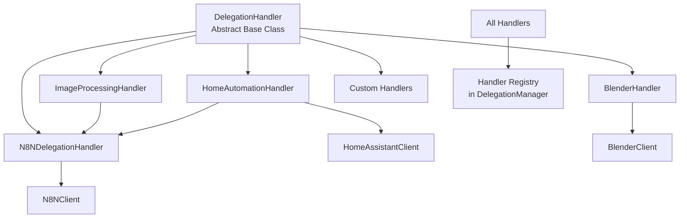
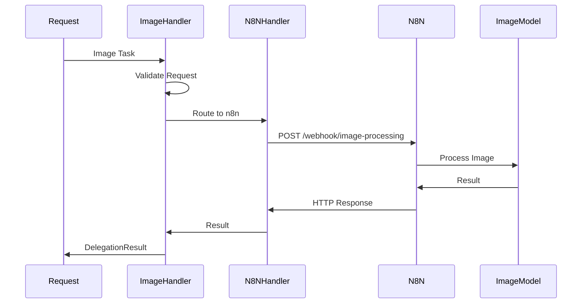
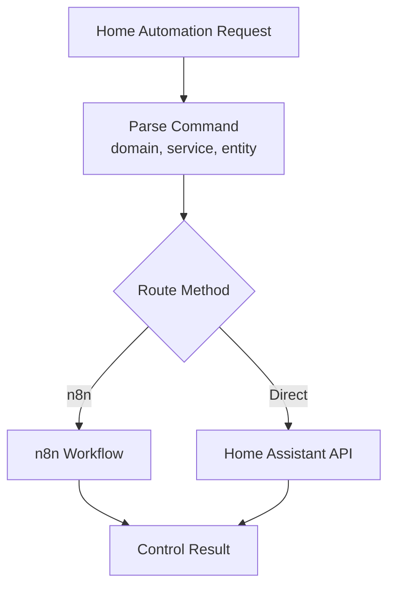
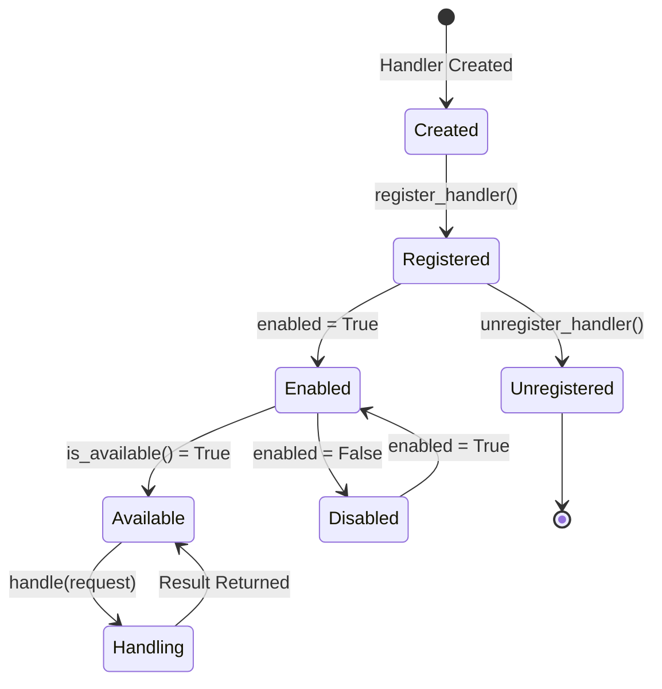
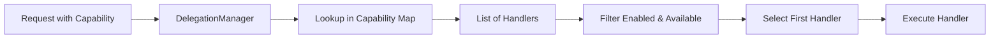

# Delegation Handlers Architecture

The handler system provides a plugin-based architecture for extending Janet's delegation capabilities.

## Purpose

Handlers are modular components that:
- Implement specific capabilities (image processing, home automation, etc.)
- Can be registered dynamically
- Support capability-based routing
- Enable extensible delegation system

## Architecture



## Handler Interface

All handlers must implement:

```python
class DelegationHandler(ABC):
    def get_capabilities(self) -> List[HandlerCapability]
    def can_handle(self, request: DelegationRequest) -> bool
    def handle(self, request: DelegationRequest) -> DelegationResult
    def is_available(self) -> bool
```

## Built-in Handlers

### ImageProcessingHandler

Routes image tasks to n8n workflows.

**Capabilities:**
- `IMAGE_PROCESSING` - Image analysis
- `IMAGE_GENERATION` - Image generation

**Flow:**



### HomeAutomationHandler

Controls smart home devices.

**Capabilities:**
- `HOME_AUTOMATION` - Smart home control

**Flow:**



### BlenderHandler

3D modelling via Blender MCP addon.

**Capabilities:**
- `THREE_D_MODELLING` - Create objects in Blender (cube, sphere, cylinder, etc.)

**Setup:** Blender must be running with the Blender MCP addon installed and connected (localhost:9876). Say "Hey Janet, add a cube in Blender" to trigger.

**Supported commands:** cube, sphere, cylinder, cone, plane, torus, monkey (Suzanne), clear scene.

### N8NDelegationHandler

Generic handler for n8n workflow routing.

**Capabilities:**
- Configurable via workflow mapping
- Supports multiple capabilities

**Workflow Mapping:**
```python
workflow_map = {
    HandlerCapability.IMAGE_PROCESSING: "/webhook/image-processing",
    HandlerCapability.HOME_AUTOMATION: "/webhook/home-automation",
}
```

## Creating Custom Handlers

### Example: Weather Handler

```python
from delegation.handlers.base import (
    DelegationHandler, DelegationRequest, DelegationResult, HandlerCapability
)

class WeatherHandler(DelegationHandler):
    def __init__(self, api_key: str):
        super().__init__("weather_handler", "Weather Handler")
        self.api_key = api_key
    
    def get_capabilities(self):
        return [HandlerCapability.WEATHER]
    
    def can_handle(self, request):
        return (
            request.capability == HandlerCapability.WEATHER and
            self.is_available()
        )
    
    def handle(self, request):
        location = request.input_data.get("location")
        # Fetch weather data
        weather_data = self._fetch_weather(location)
        
        return DelegationResult(
            success=True,
            output_data={"weather": weather_data},
            message=f"Weather for {location}: {weather_data['condition']}"
        )
    
    def is_available(self):
        return self.api_key is not None
    
    def _fetch_weather(self, location):
        # Implementation
        pass
```

### Registration

```python
from delegation import DelegationManager

manager = DelegationManager()
weather_handler = WeatherHandler(api_key="your_key")
manager.register_handler(weather_handler)
```

## Handler Lifecycle



## Capability Routing

Handlers are routed by capability:



## Best Practices

1. **Idempotency**: Handlers should be idempotent when possible
2. **Error Handling**: Return clear error messages in `DelegationResult`
3. **Availability Checks**: Always check `is_available()` before handling
4. **Red Thread**: Respect Red Thread status (checked by manager)
5. **Confirmation**: Use confirmation callbacks for sensitive operations

## See Also

- [Delegation System](../README.md) - Main delegation documentation
- [Base Handler Interface](base.py) - Handler interface definition

