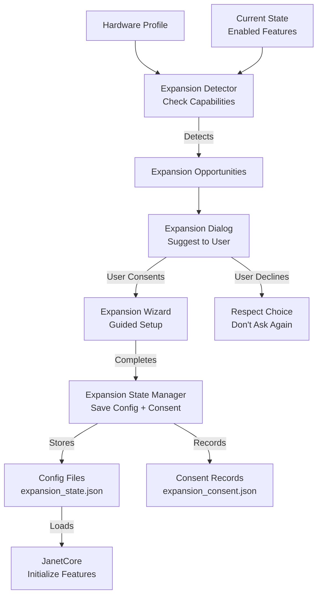
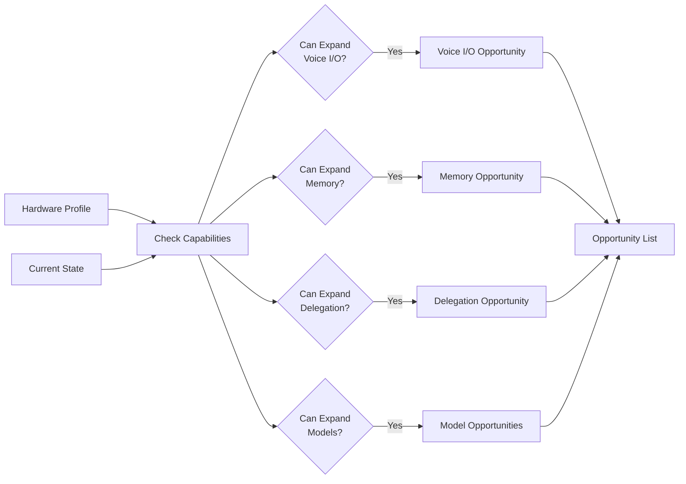
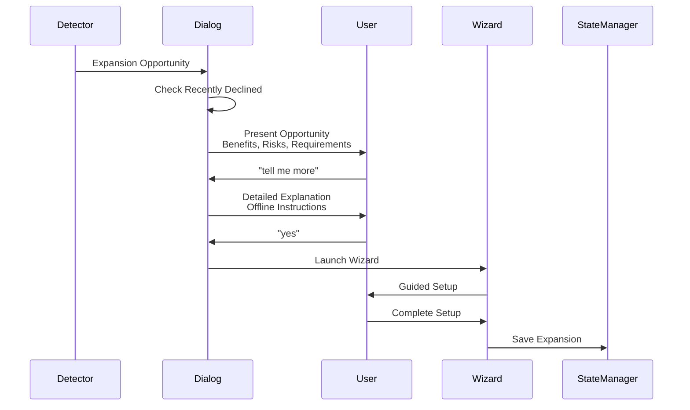
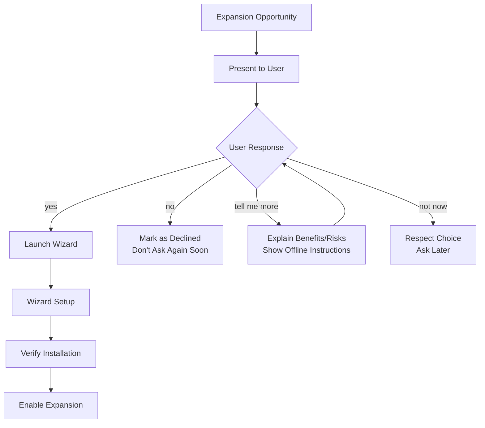
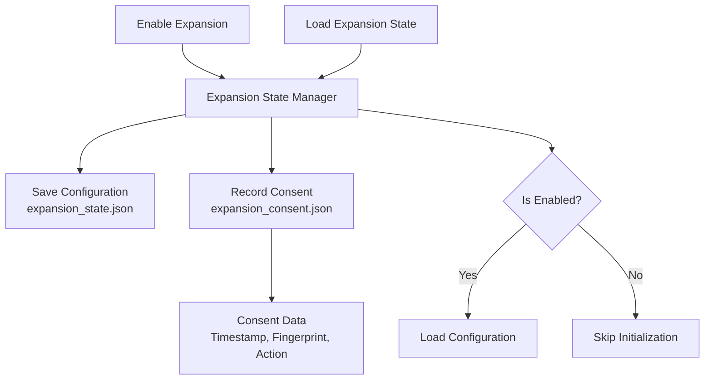
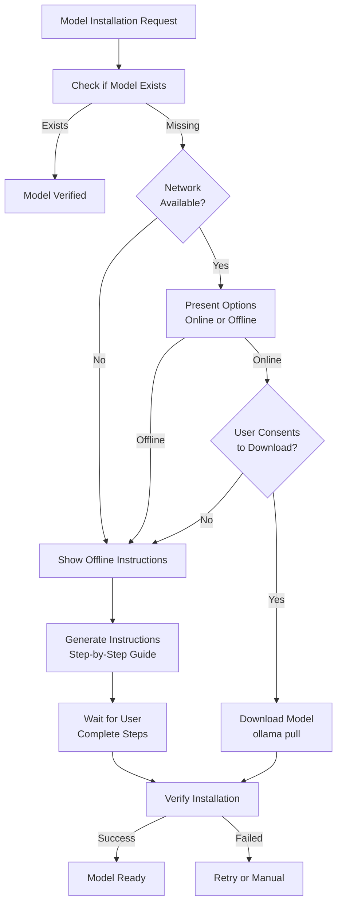
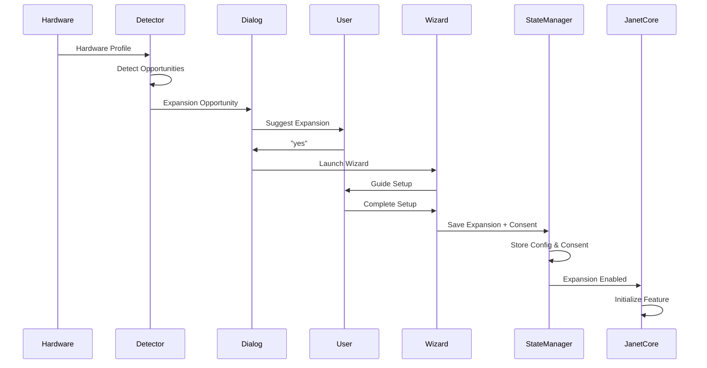
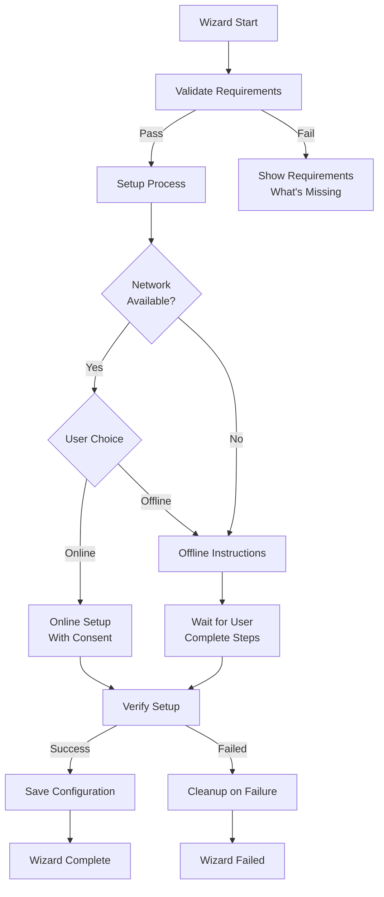

# Expansion Protocol Architecture

The expansion protocol enables Janet to detect and suggest growth opportunities while maintaining strict constitutional boundaries. All expansions require explicit consent and work offline-first.

## Purpose

The expansion system provides:
- **Detection**: Identify available expansion opportunities based on hardware
- **Suggestion**: Proactively suggest expansions (never auto-install)
- **Wizards**: Step-by-step guided setup for each expansion type
- **State Management**: Track enabled expansions with consent records
- **Offline-First**: All expansions work without network connection

## Architecture



## Core Principles

1. **Never Auto-Install** - All expansion requires explicit human action
2. **Offline-First** - All expansions work without network
3. **Suggest, Don't Assume** - Janet can detect but only suggests
4. **Explain Benefits and Risks** - Clear information for each opportunity
5. **Step-by-Step Guidance** - Guided wizards for setup
6. **Reversible** - Users can disable expansions at any time

## Key Components

### ExpansionDetector

Detects available expansion opportunities:



**Detection Logic:**
- Checks hardware capabilities (RAM, disk, CPU, GPU)
- Checks current state (what's already enabled)
- Compares requirements vs available resources
- Returns list of possible expansions

### ExpansionDialog

Proactive suggestion system:



**Dialogue Flow:**



### ExpansionStateManager

Manages expansion state and consent:



**Consent Records:**
- Timestamp of consent
- Hardware fingerprint
- Action (enabled/disabled)
- Expansion type
- Configuration snapshot

### ModelManager

Offline-first model detection and installation guidance:



**Offline Installation Guide:**
1. Download on connected device: `ollama pull <model>`
2. Find model files (platform-specific path)
3. Transfer files (USB, network share, etc.)
4. Place files in correct location
5. Verify installation: `ollama list`

## Expansion Flow

Complete expansion lifecycle:



## Expansion Types

### Voice I/O
- Speech-to-text and text-to-speech
- Wake word detection
- Tone awareness

### Persistent Memory
- Memory vault system
- Encrypted storage
- Semantic search

### Task Delegation
- Specialized model routing
- n8n integration
- Home Assistant control

### Model Installation
- Additional Ollama models
- Offline-first installation
- Model verification

### n8n Integration
- Workflow automation
- Webhook routing
- Custom integrations

### Home Assistant Integration
- Smart home control
- Device management
- Automation triggers

## Wizard System

All expansions use guided wizards:



## Constitutional Integration

### Consent (Axiom 9, Expansion Protocol)

Every expansion requires:
- Explicit consent before any action
- Consent stored with timestamp and fingerprint
- User can revoke consent at any time
- No silent or automatic expansions

### Soul Check (Axiom 10)

Triggered before major expansions:
- Delegation setup
- Integration setup
- Model installation (large models)

### Grounding (Axiom 6)

Expansion suggestions are grounded:
- Based on actual hardware capabilities
- No grandiose promises
- Only what hardware actually supports

### Red Thread (Axiom 8)

Expansion processes respect Red Thread:
- Suggestions blocked when active
- Wizards can be interrupted
- Failed expansions clean up safely

## Usage

### Detecting Opportunities

```python
from expansion import ExpansionDetector
from hardware_detector import HardwareProfile

hardware = HardwareProfile(...)
current_state = {"voice_io_enabled": False}
detector = ExpansionDetector(hardware, current_state)

opportunities = detector.detect_available_expansions()
for opp in opportunities:
    print(f"{opp.name}: {opp.description}")
```

### Suggesting Expansions

```python
from expansion import ExpansionDialog

dialog = ExpansionDialog(janet_core=janet)
if dialog.suggest_expansion(opportunity):
    # User accepted, launch wizard
    janet.run_expansion_wizard(opportunity.expansion_type)
```

### Managing State

```python
from expansion import ExpansionStateManager
from pathlib import Path

state_manager = ExpansionStateManager(Path("/path/to/config"))
state = state_manager.load_expansion_state()

if state.is_enabled("voice_io"):
    config = state.get_config("voice_io")
    # Initialize voice I/O with config
```

## Dependencies

- `hardware_detector` - Hardware capability detection
- `constitution_loader` - Constitutional integration
- `ollama` - Model detection (for model installation)

## Files

- `expansion_detector.py` - Opportunity detection
- `expansion_dialog.py` - Suggestion dialogues
- `expansion_state.py` - State management
- `expansion_types.py` - Data structures
- `model_manager.py` - Model detection and offline guidance
- `wizards/` - Expansion wizards (see [Wizards README](wizards/README.md))

## See Also

- [Expansion Wizards](wizards/README.md) - Wizard system documentation
- [Core System](../core/README.md) - How expansion integrates with JanetCore
- [User Guide](../../documentation/EXPANSION_GUIDE.md) - User-facing expansion guide
- [Offline Installation](../../documentation/OFFLINE_INSTALLATION.md) - Offline model installation

