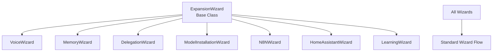
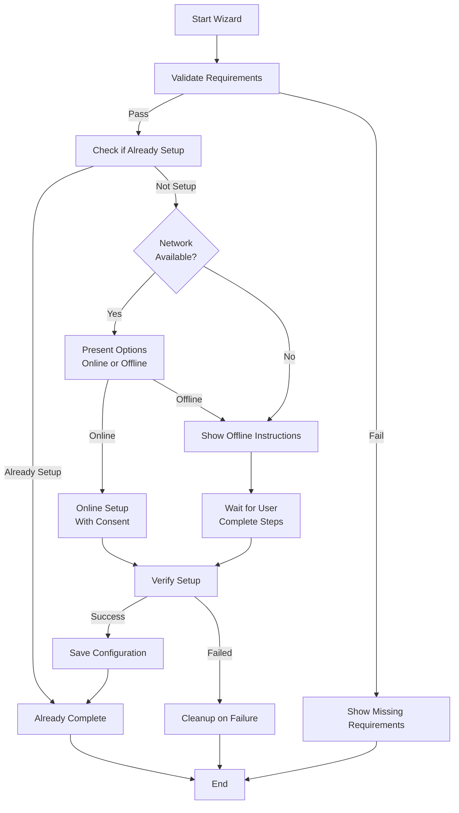
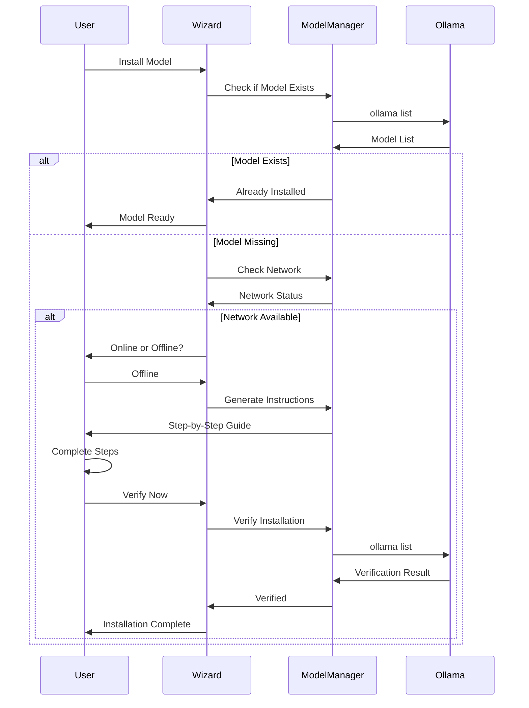
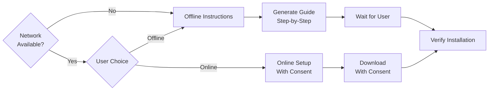

# Expansion Wizards

Guided setup wizards for each expansion type. All wizards work offline-first and require explicit consent.

## Purpose

Wizards provide:
- Step-by-step guided setup
- Offline installation instructions
- Requirement validation
- Setup verification
- Failure cleanup

## Architecture



## Wizard Base Class

All wizards inherit from `ExpansionWizard`:

```python
class ExpansionWizard:
    def run(self) -> bool  # Main wizard flow
    def validate_requirements(self) -> Tuple[bool, List[str]]
    def setup(self) -> bool  # Online or offline setup
    def verify(self) -> bool  # Verify installation
    def cleanup_on_failure(self)  # Cleanup on error
    def check_network_available(self) -> bool
    def generate_offline_instructions(self) -> str
```

## Standard Wizard Flow



## Wizard Types

### VoiceWizard

Sets up voice I/O capabilities.

**Steps:**
1. Check hardware (microphone, speaker)
2. Validate dependencies (Whisper, sounddevice, pyttsx3)
3. Test audio input/output
4. Configure voice preferences
5. Save configuration

### MemoryWizard

Sets up persistent memory system.

**Steps:**
1. Check disk space (5GB minimum)
2. Initialize memory directory
3. Set up vaults (Green, Blue, Red)
4. Configure encryption
5. Test memory operations

### DelegationWizard

Sets up task delegation system.

**Steps:**
1. Check hardware (8GB RAM minimum)
2. Validate LiteLLM installation
3. Configure model routing
4. Set up n8n (optional)
5. Set up Home Assistant (optional)
6. Test delegation

### ModelInstallationWizard

Guides offline-first model installation.

**Flow:**



### N8NWizard

Sets up n8n integration.

**Steps:**
1. Request n8n URL
2. Request API key (optional)
3. Test connection
4. Configure workflow mappings
5. Save configuration

### HomeAssistantWizard

Sets up Home Assistant integration.

**Steps:**
1. Request Home Assistant URL
2. Request access token
3. Test connection
4. Discover available devices
5. Save configuration

### LearningWizard

Sets up learning/fine-tuning system.

**Steps:**
1. Review Green Vault summaries
2. Select summaries for training
3. Request explicit consent
4. Choose model for fine-tuning
5. Initiate learning process
6. Set up fine-tuned model

## Offline-First Design

All wizards support offline installation:



## Constitutional Integration

### Consent Required

All wizards require:
- Explicit consent before any action
- Clear explanation of what will happen
- Option to cancel at any time

### Soul Check

Triggered before:
- Major model installations
- Integration setups
- Learning system activation

### Red Thread

Wizards respect Red Thread:
- Can be interrupted at any time
- Clean up on failure
- Don't proceed when active

## Creating Custom Wizards

```python
from expansion.wizards.wizard_base import ExpansionWizard

class CustomWizard(ExpansionWizard):
    def run(self) -> bool:
        print("Custom Wizard")
        if not self.validate_requirements()[0]:
            return False
        
        # Setup process
        if self.setup():
            return self.verify()
        return False
    
    def validate_requirements(self):
        # Check requirements
        return True, []
    
    def setup(self) -> bool:
        # Implement setup
        return True
    
    def verify(self) -> bool:
        # Verify installation
        return True
```

## See Also

- [Expansion Protocol](../README.md) - Main expansion documentation
- [Wizard Base](wizard_base.py) - Base class implementation

