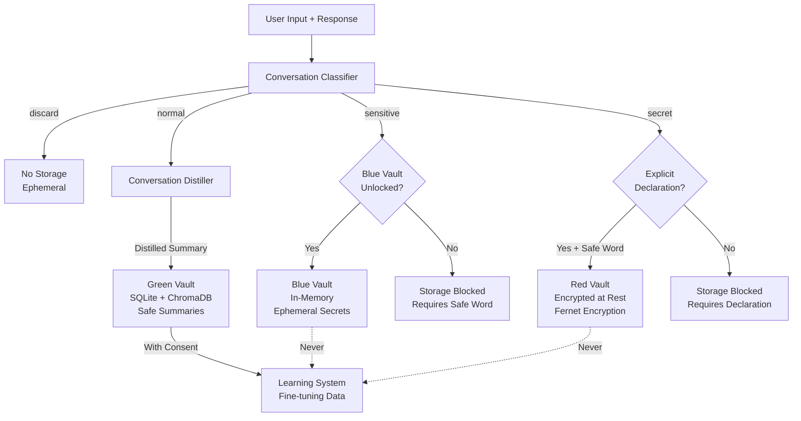
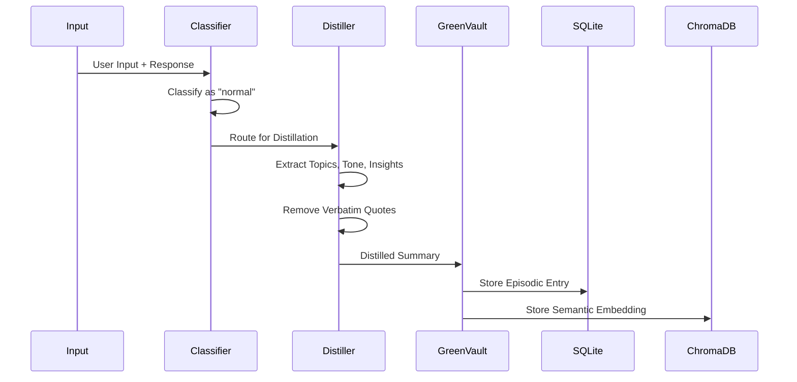
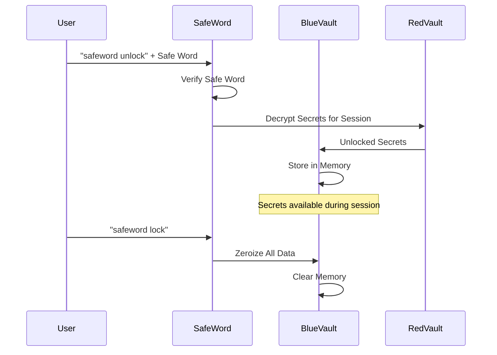
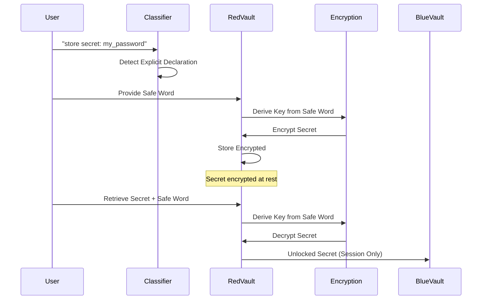
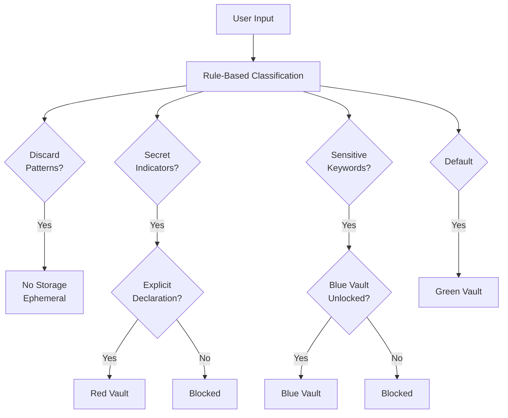
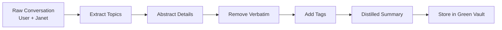
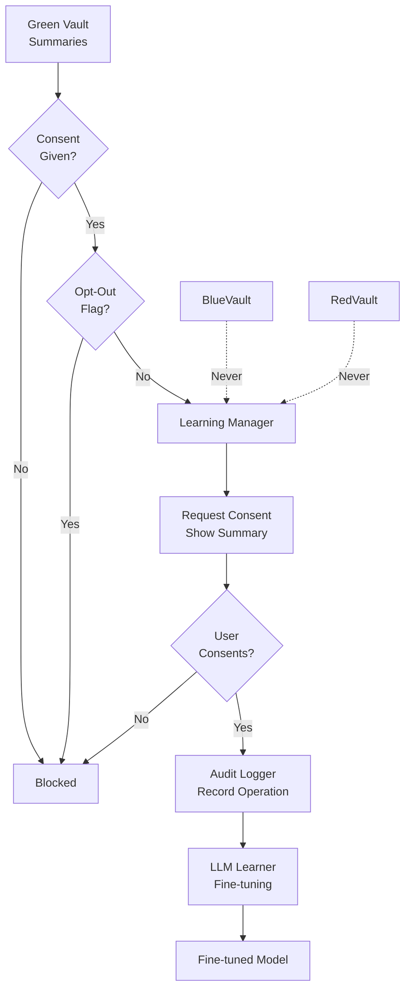
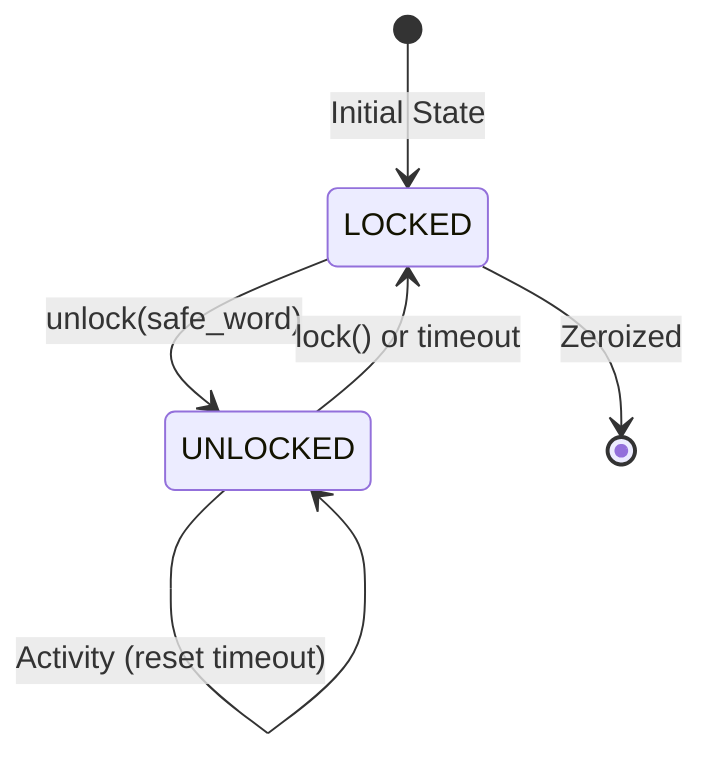
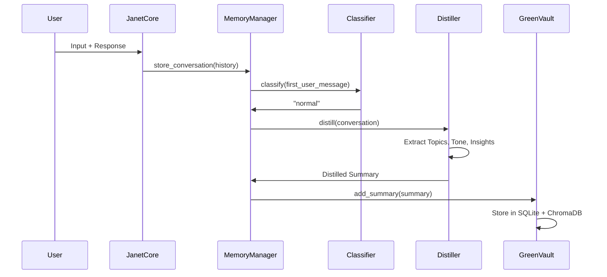

# Memory System Architecture

The memory system implements a three-vault architecture that protects secrets while enabling safe learning and context retrieval.

## Purpose

The memory system provides:
- **Green Vault**: Safe, distilled summaries for context and learning
- **Blue Vault**: Ephemeral secrets unlocked during session
- **Red Vault**: Encrypted secrets at rest
- **Classification**: Automatic routing to appropriate vault
- **Distillation**: Safe abstraction of conversations
- **Learning System**: Fine-tuning from Green Vault only

## Architecture



## Vault System

### Green Vault (Safe Summaries)

**Purpose**: Store distilled, non-sensitive summaries for context retrieval and learning.

**Storage:**
- SQLite: Episodic memory (timestamps, summaries)
- ChromaDB: Semantic search (vector embeddings)

**Allowed:**
- Abstract summaries (no verbatim quotes)
- Topic tags and themes
- Emotional tone indicators
- Actionable insights
- Learning/training data (with explicit consent)

**Flow:**



### Blue Vault (Ephemeral Secrets)

**Purpose**: Store unlocked secrets during active session.

**Storage:**
- In-memory only
- Zeroized on lock
- Never persisted

**Flow:**



### Red Vault (Encrypted Secrets)

**Purpose**: Store persistent secrets encrypted at rest.

**Storage:**
- Encrypted with Fernet (symmetric encryption)
- Key derived from safe word (never stored)
- Explicit declaration required

**Flow:**



## Classification System

Conversations are automatically classified into four categories:



**Classification Categories:**

1. **discard**: Ephemeral conversations (greetings, simple responses)
2. **normal**: Safe for Green Vault (general conversations)
3. **sensitive**: Requires Blue Vault unlock (personal, emotional, health)
4. **secret**: Requires explicit declaration (passwords, API keys, credentials)

## Distillation Process

Converts raw conversations into safe summaries:



**Distillation Steps:**
1. Extract topics and themes
2. Identify emotional tone (if relevant)
3. Extract actionable insights
4. Remove verbatim quotes
5. Create abstract summary
6. Add topic tags
7. Calculate confidence score

## Learning System

Only Green Vault summaries can be used for learning:



**Learning Safeguards:**
- Explicit consent required for each summary
- Opt-out available at any time
- Full audit trail of all operations
- Blue/Red Vaults explicitly forbidden

## SafeWord Controller

Manages Blue Vault access:



**Features:**
- Auto-lock timeout (configurable)
- Zeroization on lock
- Thread-safe operations
- Red Vault key derivation

## Memory Storage Flow

Complete storage flow from input to vault:



## Constitutional Integration

### Memory Gates (Axiom 9)

Controls when memory writes are allowed:
- Checks Red Thread status
- Validates constitutional rules
- Respects "don't remember" requests
- Requires explicit consent for secrets

### Red Thread Protocol (Axiom 8)

All memory operations check Red Thread:
- Storage blocked when active
- Search blocked when active
- Deletion blocked when active
- Immediate stop on invocation

### Secrets Sacred (Memory Constitution)

Secrets are never:
- Embedded or used for training
- Summarized or abstracted
- Stored without explicit declaration
- Exposed without safe word

## Usage

### Storing Conversations

```python
from memory import MemoryManager
from pathlib import Path

memory_dir = Path("/path/to/memory")
memory_manager = MemoryManager(memory_dir)

# Store conversation (automatic classification)
memory_manager.store_conversation(conversation_history, context)
```

### Searching Memories

```python
# Search Green Vault (semantic search)
results = memory_manager.search("python programming", n_results=5)
for result in results:
    print(result['text'])
```

### SafeWord Operations

```python
from core.presence.safeword import SafeWordController

safe_word = SafeWordController()
blue_vault = memory_manager.blue_vault

# Unlock Blue Vault
safe_word.unlock("my_safe_word", blue_vault)

# Lock and zeroize
safe_word.lock(blue_vault)
```

## Dependencies

- `chromadb` - Semantic search and embeddings
- `cryptography` - Fernet encryption for Red Vault
- `sqlite3` - Episodic memory storage

## Files

- `memory_manager.py` - Unified memory interface
- `green_vault.py` - Safe summary storage
- `blue_vault.py` - Ephemeral secret storage
- `red_vault.py` - Encrypted secret storage
- `classification.py` - Conversation classification
- `distillation.py` - Summary distillation
- `memory_gates.py` - Constitutional memory gates
- `learning_manager.py` - Learning system manager
- `learning_audit.py` - Learning operation audit
- `llm_learner.py` - LLM fine-tuning integration

## See Also

- [Memory Constitution](../../constitution/MEMORY_CONSTITUTION.md) - Immutable memory principles
- [Core System](../core/README.md) - How memory integrates with JanetCore
- [SafeWord Controller](../core/presence/safeword.py) - Blue Vault access control

