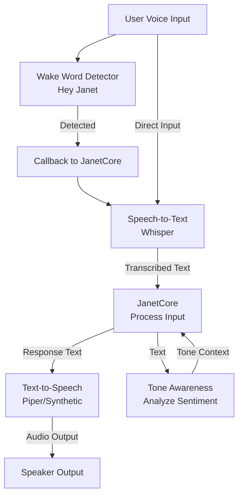
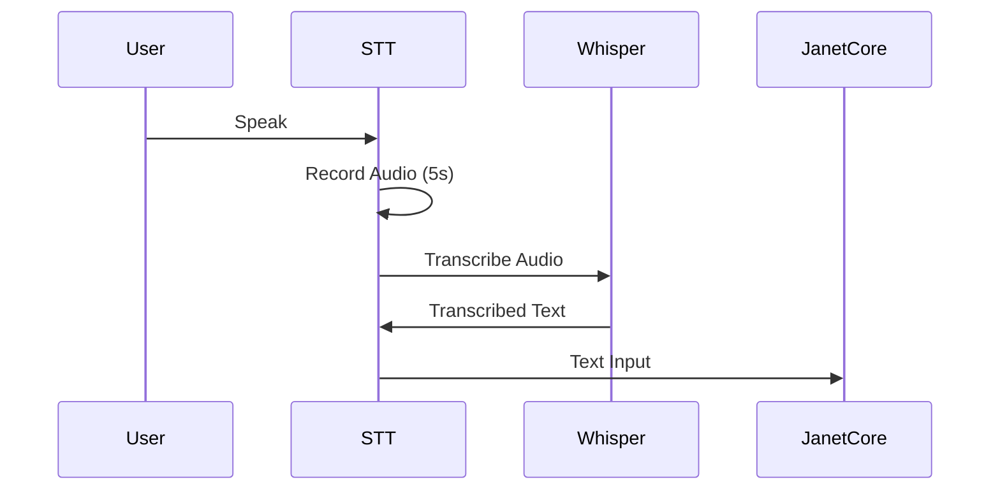
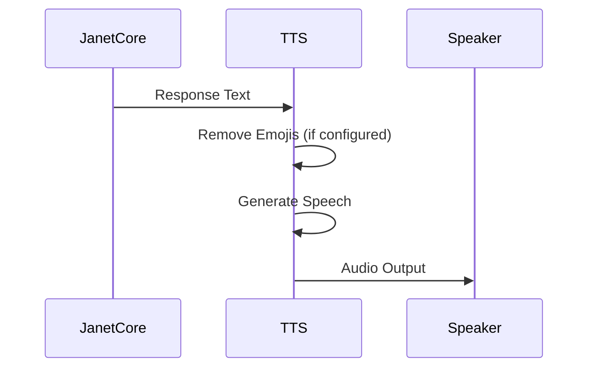
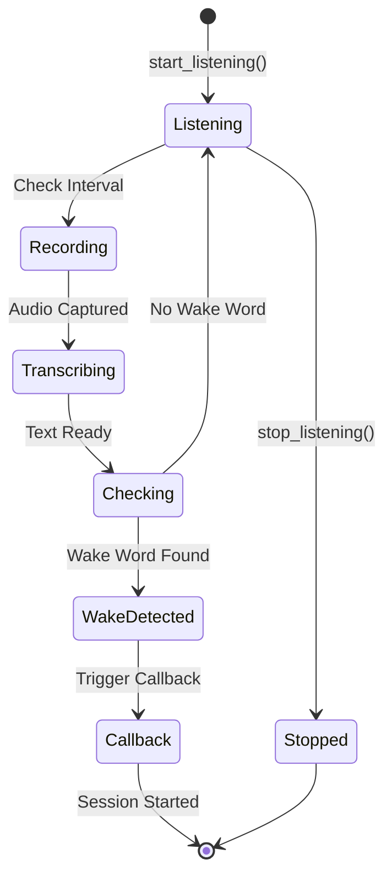
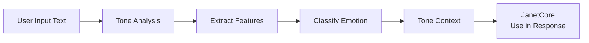
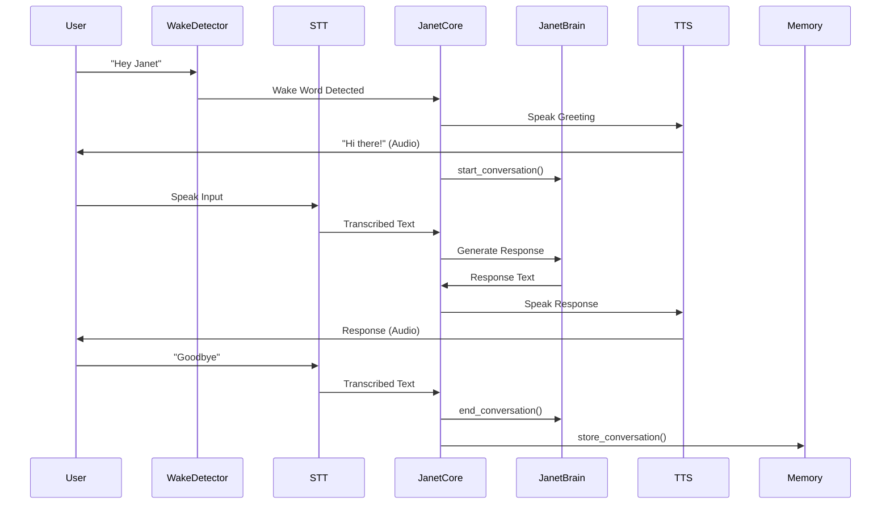

# Voice I/O System

The voice system enables natural voice interaction with Janet through speech-to-text, text-to-speech, wake word detection, and tone awareness.

## Purpose

The voice system provides:
- **Speech-to-Text (STT)**: Transcribe spoken input using Whisper
- **Text-to-Speech (TTS)**: Generate synthetic speech output
- **Wake Word Detection**: Listen for "Hey Janet" to activate
- **Tone Awareness**: Analyze emotional tone and sentiment

## Architecture



## Key Components

### SpeechToText (STT)

Transcribes spoken audio to text using OpenAI Whisper.

**Features:**
- Multiple model sizes (tiny, base, small, medium, large)
- Auto language detection
- Real-time audio recording
- Offline operation (after model download)

**Flow:**



**Usage:**
```python
from voice import SpeechToText

stt = SpeechToText(model_size="base")
if stt.is_available():
    text = stt.listen_and_transcribe(duration=5.0)
    print(f"You said: {text}")
```

### TextToSpeech (TTS)

Converts text responses to synthetic speech.

**Features:**
- Configurable voice style
- Emoji removal for voice mode
- Platform-agnostic output
- Natural-sounding synthesis

**Flow:**



**Usage:**
```python
from voice import TextToSpeech

tts = TextToSpeech(voice_style="clear, warm, slightly synthetic")
if tts.is_available():
    tts.speak("Hello! How can I help you?", remove_emojis=True)
```

### WakeWordDetector

Continuously listens for wake phrases to activate Janet.

**Features:**
- Thread-safe detection
- Multiple wake phrases ("Hey Janet", "Janet", etc.)
- Red Thread integration (stops on emergency)
- Callback-based activation

**Flow:**



**Wake Phrases:**
- "hey janet"
- "janet"
- "hey jan"
- "janet wake up"

**Usage:**
```python
from voice import WakeWordDetector, SpeechToText

def on_wake_detected():
    print("Wake word detected!")

stt = SpeechToText(model_size="tiny")
wake_detector = WakeWordDetector(stt=stt, callback=on_wake_detected)
wake_detector.start_listening()
```

### ToneAwareness

Analyzes emotional tone and sentiment from text.

**Features:**
- Emotion detection (positive, negative, neutral)
- Sentiment analysis
- Context-aware tone assessment
- Constitutional integration (grounded, not authoritative)

**Flow:**



**Usage:**
```python
from voice import ToneAwareness

tone = ToneAwareness()
analysis = tone.analyze_text("I'm feeling really frustrated today")
print(analysis)  # {"emotion": "negative", "sentiment": "frustrated", ...}
```

## Voice Interaction Flow

Complete voice interaction lifecycle:



## Constitutional Integration

### Red Thread Protocol (Axiom 8)

The wake word detector respects Red Thread:
- Stops listening immediately when Red Thread is invoked
- Checks `RED_THREAD_EVENT` before processing
- Gracefully handles emergency stops

### Grounding (Axiom 6)

Tone awareness is grounded:
- Tone analysis is descriptive, not prescriptive
- Janet acknowledges tone but doesn't assume it's authoritative
- Emotional state is context, not truth

## Dependencies

**Required:**
- `openai-whisper` - Speech-to-text model
- `sounddevice` - Audio recording
- `numpy` - Audio processing
- `pyttsx3` or platform TTS - Text-to-speech

**Installation:**
```bash
pip install openai-whisper sounddevice numpy pyttsx3
```

## Configuration

Voice settings are configured in `constitution/personality.json`:

```json
{
  "wake_word": {
    "phrases": ["hey janet", "janet"],
    "response": ["Hi there!", "Yes?", "I'm here."]
  },
  "preferences": {
    "voice_style": "clear, warm, slightly synthetic",
    "avoid_emojis_in_voice_mode": true
  },
  "tone_awareness": {
    "enabled": true,
    "schema": "emotional_state, sentiment, intensity"
  }
}
```

## Files

- `stt.py` - Speech-to-text using Whisper
- `tts.py` - Text-to-speech synthesis
- `wake_word.py` - Wake word detection
- `tone_awareness.py` - Tone and sentiment analysis

## See Also

- [Core System](../core/README.md) - How voice integrates with JanetCore
- [Memory System](../memory/README.md) - Tone context in memory storage
- [Constitution](../../constitution/README.md) - Voice preferences and tone schema

