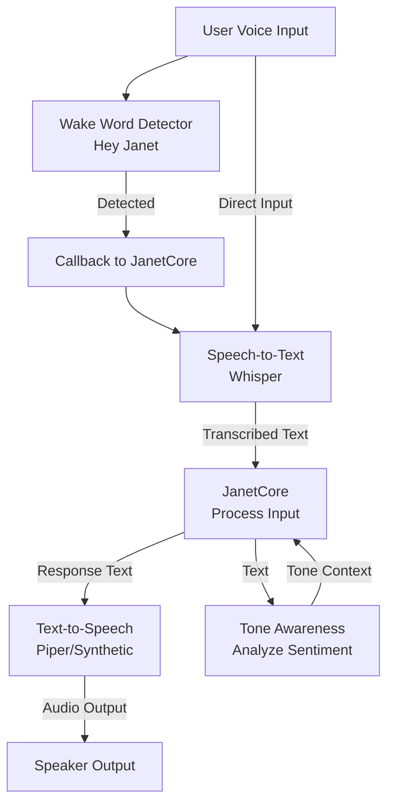
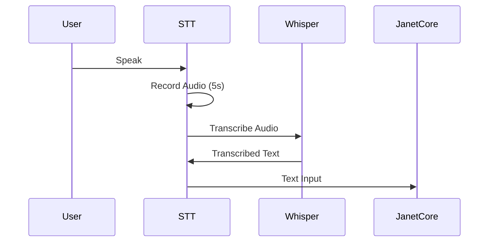
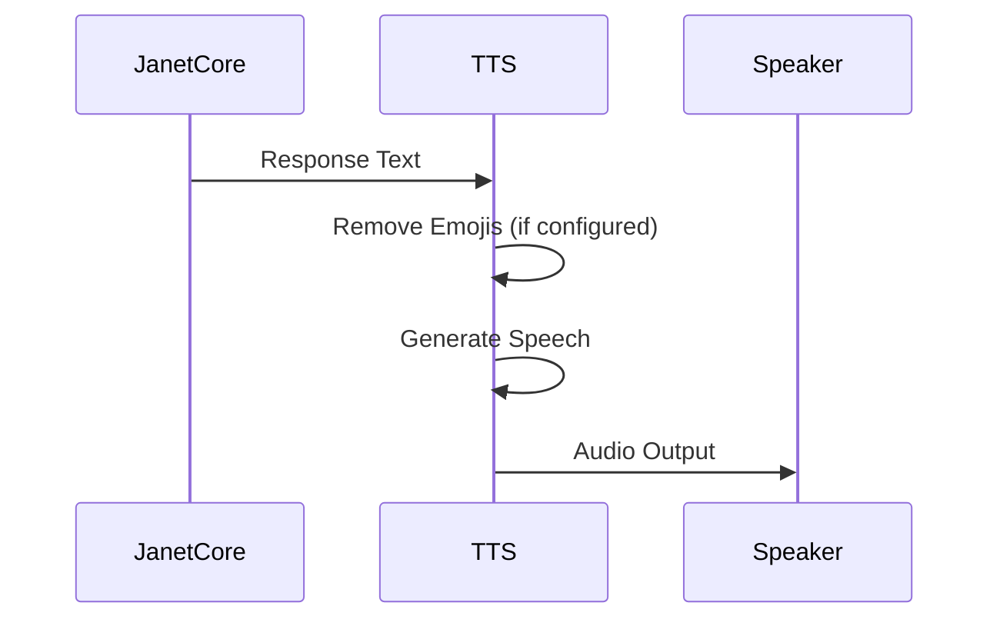
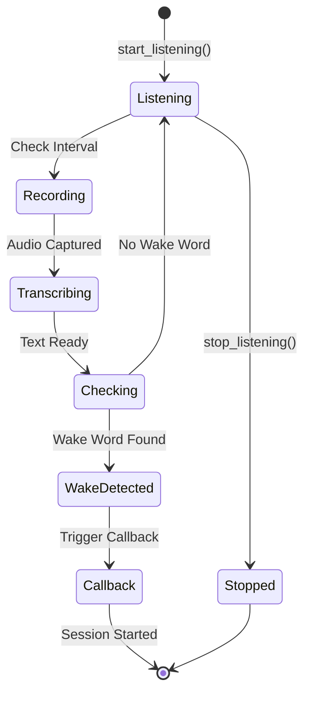
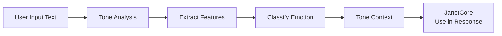
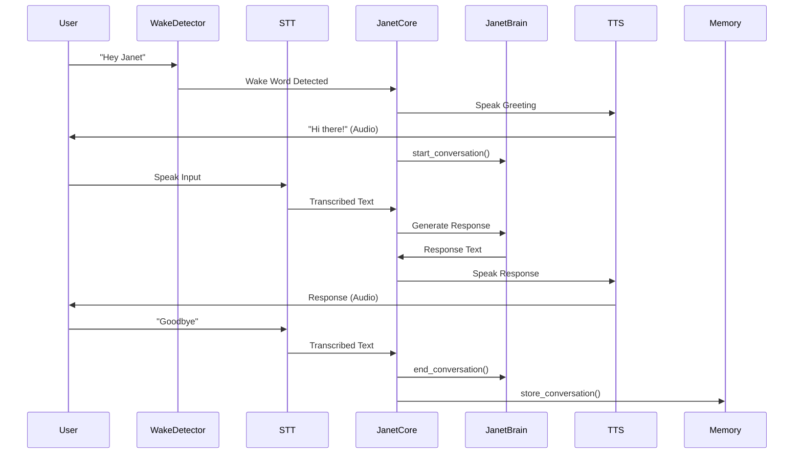

# Voice I/O System

The voice system enables natural voice interaction with Janet through speech-to-text, text-to-speech, wake word detection, and tone awareness.

## Purpose

The voice system provides:
- **Speech-to-Text (STT)**: Transcribe spoken input using Whisper
- **Text-to-Speech (TTS)**: Generate synthetic speech output
- **Wake Word Detection**: Listen for "Hey Janet" to activate
- **Tone Awareness**: Analyze emotional tone and sentiment

## Architecture



## Key Components

### SpeechToText (STT)

Transcribes spoken audio to text using OpenAI Whisper.

**Features:**
- Multiple model sizes (tiny, base, small, medium, large)
- Auto language detection
- Real-time audio recording
- Offline operation (after model download)

**Flow:**



**Usage:**
```python
from voice import SpeechToText

stt = SpeechToText(model_size="base")
if stt.is_available():
    text = stt.listen_and_transcribe(duration=5.0)
    print(f"You said: {text}")
```

### TextToSpeech (TTS)

Converts text responses to synthetic speech.

**Features:**
- Configurable voice style
- Emoji removal for voice mode
- Platform-agnostic output
- Natural-sounding synthesis

**Flow:**



**Usage:**
```python
from voice import TextToSpeech

tts = TextToSpeech(voice_style="clear, warm, slightly synthetic")
if tts.is_available():
    outcome = tts.speak("Hello! How can I help you?", remove_emojis=True, lang="auto")
    # outcome.spoken, outcome.skipped, outcome.resolved_lang, outcome.reason
```

### TTS configuration (environment)

All synthesis is **local** (no cloud). On macOS the default engine is the **`say`** command with locale voices; optionally use **Piper** (`.onnx` models) for better Croatian or English. Emoji cleanup before `say` uses **narrow Unicode ranges** so **Japanese/CJK text is never stripped** by mistake.

| Variable | Default | Meaning |
|----------|---------|---------|
| `JANET_TTS_LANG` | `auto` | Default when `lang` is omitted: `hr` if text has Croatian diacritics (`čćžšđ…`), else `de_at` if German umlauts (`äöüß…`), else `ja` if text has **Hiragana/Katakana** (romaji-only → use explicit `lang: ja`), else `en`. |
| `JANET_TTS_VOICE_EN` | `Samantha` | macOS `say` voice for English — default is **female** (`en_US`). Override anytime (e.g. `Daniel`, `Moira`, **`Kathy`** for an alternate boardroom timbre). |
| `JANET_TTS_EN_PRESET` | unset | **`lynda-business`** — measured, softer English (**~132 WPM** via `JANET_TTS_SAY_RATE_LYNDA`; default **`Kathy`** if `VOICE_EN` unset). **`good-place-janet`** (*The Good Place* fan homage, not NBCUniversal) — **less robotic** than Shelley/Flo: default **`Samantha`** + **~148 WPM** (slower = more human on `say`). **Best quality:** install an **Enhanced** English voice in **System Settings → Accessibility → Spoken Content** (Manage Voices), then set **`JANET_TTS_VOICE_EN`** to that exact name. **Neural:** Piper female `en_US` model + `JANET_PIPER_EN_*` + `engine=piper` / `JANET_TTS_ENGINE`. Preset script: `apply en-lynda-business` / `apply en-good-place-janet`. |
| `JANET_TTS_SLAVIC_ACCENT` | unset | If `1` / `true` and **`JANET_TTS_VOICE_EN` is not set**, English uses **`Daria` (`bg_BG`)** for a Slavic/Eastern European colour (voice is **female**). There is no stock **male + Slavic + English** `say` voice on most Macs — use **Piper** with a male model for that. |
| `JANET_TTS_VOICE_HR` | `Lana` | Default **female**, native **`hr_HR`** via macOS `say`. Set **`JANET_TTS_VOICE_HR=Fred`** for the old male timbre; for Piper Slavic timbre use **`JANET_PIPER_HR_MODEL`** + `JANET_TTS_HR_MODE=piper`. |
| `JANET_TTS_VOICE_DE_AT` | `Anna` | macOS `say` voice for German (`POST /api/speak` `lang`: `de`, `de-AT`, `deutsch`, `german`, …). Bundled voices are typically `de_DE` (e.g. Anna); Austrian text uses the same engine. Override e.g. `Eddy (German (Germany))`. |
| `JANET_TTS_VOICE_JA` | `Kyoko` | macOS **`ja_JP`** voice for Japanese (`lang`: `ja`, `jp`, `japanese`, `nihongo`, or **auto** when input contains kana). **[rhasspy/piper-voices](https://huggingface.co/rhasspy/piper-voices) has no Japanese pack**; use `say` on macOS, or set **`JANET_PIPER_JA_MODEL`** / **`JANET_PIPER_JA_CONFIG`** if you add a Japanese Piper ONNX elsewhere. List voices: `say -v '?'` (look for `ja_JP`, e.g. **Shelley (Japanese (Japan))**). |
| `JANET_TTS_SAY_RATE_JA` | unset | Japanese `say -r` override (falls back to `JANET_TTS_SAY_RATE`). |
| `JANET_TTS_SAY_RATE` | `165` | Default words per minute for `say -r` (all languages unless overridden below). |
| `JANET_TTS_SAY_RATE_EN` | unset | English-only WPM; overrides Lynda preset rate when set. |
| `JANET_TTS_SAY_RATE_LYNDA` | `132` while `JANET_TTS_EN_PRESET=lynda-business` | WPM for Lynda English when preset is on and `JANET_TTS_SAY_RATE_EN` is unset. Use **120–128** for extra-soft delivery; **Shelley (English (US))** often sounds less crisp than Samantha. |
| `JANET_TTS_SAY_RATE_TGP_JANET` | `148` while `JANET_TTS_EN_PRESET=good-place-janet` | WPM for **good-place-janet** when `JANET_TTS_SAY_RATE_EN` is **unset**. Ignored if `SAY_RATE_EN` is set (that wins). |
| `JANET_TTS_SAY_RATE_HR` | unset | Croatian WPM override. |
| `JANET_TTS_SAY_RATE_DE_AT` | unset | German WPM override. |
| `JANET_TTS_SKIP_HR` | unset | If `1` / `true`, Croatian is **not** spoken (API returns `skipped: true`, `reason: hr_disabled`). Same as `JANET_TTS_HR_MODE=off`. |
| `JANET_TTS_HR_MODE` | `say` | `off` — no HR audio; `say` — HR via macOS/pyttsx3; `piper` — HR via Piper when `JANET_PIPER_HR_MODEL` is set (falls back to `say` if Piper fails). |
| `JANET_TTS_HR_FALLBACK_EN` | unset | If `1` and HR is disabled, speak using the **English** voice anyway (mispronounces Croatian; experimental). |
| `JANET_TTS_ENGINE` | `auto` | `say` — never Piper; `piper` — Piper only (with fallback to `say` on failure where implemented); `auto` — Piper when a model path exists for the effective language, else `say`. |

### The Good Place “Janet” voice (fan homage)

The [Fandom character page](https://thegoodplace.fandom.com/wiki/Janet) describes Janet as a **cheery, courteous, informational assistant** — summoned with “Hey, Janet,” **bright and helpful** with a slightly **artificial** warmth. Apple’s **built-in** `say` voices always sound somewhat synthetic; **Samantha** at **~148** WPM is the default tradeoff for **less “robot demo”** timbre than Shelley/Flo. For **more natural offline English**, use **Piper** models below (*Janet-ish*: **lessac**; brighter / younger: **amy**) or macOS **Enhanced** voices in **Accessibility → Spoken Content → Manage Voices**. *The Good Place* is property of NBCUniversal; fan presets are **not** affiliated with or endorsed by the show.

### OSS neural English (Piper) — “Janet-ish” vs brighter vs adult-leaning

From **[rhasspy/piper-voices](https://huggingface.co/rhasspy/piper-voices)** (open models; check the repo and each voice for **license** / **MODEL_CARD**). These are **real neural TTS** (not Vocaloid). **No model guarantees a specific age** (e.g. “30”); use your ear.

| Model | Role | Download |
|-------|------|----------|
| **`en_US-lessac-medium`** | Clear, natural US female — **closest “helpful assistant”** among common Piper EN voices. | `scripts/download_piper_oss_natural_en.sh` |
| **`en_US-amy-medium`** | **Younger / brighter** — more **cheerful energy** (if you like Amy, use this as the “youthful” anchor). | same script |
| **`en_US-ljspeech-medium`** | **LJ Speech** single speaker — classic **adult female narration**; usually **less “teen bright”** than Amy (good first try for “more grown-up”). | same script |
| **`en_US-kristin-medium`** | **LibriVox** US female — often **warmer / storyteller**; can feel **older** than Amy (subjective). | same script |
| **`en_US-hfc_female-medium`** | **Hi-Fi Captain** lineage, **finetuned from lessac** — **studio / mature-leaning** color vs Amy. | same script |

After download, point **`JANET_PIPER_EN_MODEL`** / **`JANET_PIPER_EN_CONFIG`** at the `.onnx` / `.onnx.json`, **`JANET_TTS_ENGINE=auto`**, restart the API. Presets: `apply en-piper-lessac`, `en-piper-amy`, `en-piper-ljspeech`, `en-piper-kristin`, `en-piper-hfc-female`.

**Piper (offline `.onnx` models)**

Official [rhasspy/piper-voices](https://huggingface.co/rhasspy/piper-voices) has **no `hr_HR` (Croatian) voice** yet. For **Latin Serbo-Croatian–style** output with a **male Slavic** timbre, use a **Serbian** medium model (e.g. `sr_RS-serbski_institut-medium`) on `JANET_PIPER_HR_MODEL` and set `JANET_TTS_HR_MODE=piper`. The Serbian package has **two speakers** — try `JANET_PIPER_HR_SPEAKER=0` or `1` (see table below); `JANET_PIPER_SPEAKER` applies if the per-lang speaker is unset.

| Variable | Meaning |
|----------|---------|
| `JANET_PIPER_BINARY` | Optional full path to `piper` executable; otherwise `piper` on `PATH`. |
| `JANET_PIPER_HR_MODEL` | Path to `.onnx` used when lang resolves to **hr** (Croatian **or** surrogate: e.g. Serbian model for closest stock Piper match). |
| `JANET_PIPER_HR_CONFIG` | Optional JSON config; if unset, TTS looks for `model.onnx.json` or `model.json` next to the `.onnx`. |
| `JANET_PIPER_HR_SPEAKER` | Optional integer for Piper `--speaker` on HR path (multi-speaker models). |
| `JANET_PIPER_EN_MODEL` | Path to English `.onnx` (used when engine is `piper`/`auto` and lang resolves to `en`; e.g. `en_US-ryan-high` for male US English). |
| `JANET_PIPER_EN_CONFIG` | Optional English JSON config. |
| `JANET_PIPER_DE_AT_MODEL` | Path to German `.onnx` when lang resolves to **`de_at`** (or set `JANET_PIPER_DE_MODEL` as fallback). |
| `JANET_PIPER_DE_AT_CONFIG` / `JANET_PIPER_DE_CONFIG` | Optional German JSON config. |
| `JANET_PIPER_DE_AT_SPEAKER` / `JANET_PIPER_DE_SPEAKER` | Optional `--speaker` for multi-de models. |
| `JANET_PIPER_JA_MODEL` / `JANET_PIPER_JA_CONFIG` | Optional Japanese `.onnx` / JSON (not in stock Piper repo); if set and `JANET_TTS_ENGINE=auto`, Japanese can use Piper. |
| `JANET_PIPER_JA_SPEAKER` | Optional `--speaker` for multi-speaker JA models. |
| `JANET_PIPER_SPEAKER` | Optional default `--speaker` if per-lang speaker not set. |

**macOS: list voices**

```bash
say -v '?'
# Croatian-related names often include Lana (hr variant depends on installed voices).
```

**Piper models:** download voices from the Piper / Rhasspy voice releases, place files on disk, point `JANET_PIPER_*_MODEL` at the `.onnx`. After download, runtime synthesis does not require network access.

**`POST /api/speak`** — optional JSON fields: `voice` (macOS `say` name for this utterance), `engine` (`say` \| `piper` \| `auto` for this request), `piper_speaker` (int, multi-speaker Piper). **`scripts/compare_croatian_tts.sh`** runs the same phrase through Lana vs Piper speakers 0 and 1.

**Runtime TL;DR defaults (no API restart)** — module `src/api/tts_tldr_plugin.py`:
- `GET /api/tts/tldr-defaults` — current defaults + `persist_path`
- `PATCH /api/tts/tldr-defaults` — JSON body with any of `lang`, `voice`, `engine`, `piper_speaker`; omit keys to leave unchanged; set a key to `null` to clear. Persisted to `data/tts_tldr_defaults.json` (or `JANET_TTS_TLDR_DEFAULTS_FILE`). Any **`POST /api/speak`** that omits those fields merges these defaults first (per-request body still wins).

Example (Lana + Croatian for IDE / TL;DR lines):

```bash
curl -sS -X PATCH http://127.0.0.1:8080/api/tts/tldr-defaults \
  -H 'Content-Type: application/json' \
  -d '{"lang":"hr","voice":"Lana","engine":"say"}'
curl -sS -X POST http://127.0.0.1:8080/api/speak \
  -H 'Content-Type: application/json' \
  -d '{"text":"Samo tekst — ostalo dolazi iz spremljenih zadanih vrijednosti."}'
```

**`POST /api/transcribe`** — offline Whisper STT (multipart field **`audio`**). Optional query `language=en|hr|…`. Requires `pip install openai-whisper` and **ffmpeg** on the server for WebM/MP3. Same `Authorization: Bearer` as `/v1` when API key is enabled. Used by the **`/chat`** page “hold mic” control.

**Response** (in addition to `status` / `message`): `spoken`, `skipped`, `resolved_lang`, and when relevant `reason`, `effective_lang`, plus `backend` (`say` \| `piper` \| `pyttsx3`) and `voice_used` when audio was synthesized.

### WakeWordDetector

Continuously listens for wake phrases to activate Janet.

**Features:**
- Thread-safe detection
- Multiple wake phrases ("Hey Janet", "Janet", etc.)
- Red Thread integration (stops on emergency)
- Callback-based activation

**Flow:**



**Wake Phrases:**
- "hey janet"
- "janet"
- "hey jan"
- "janet wake up"

**Usage:**
```python
from voice import WakeWordDetector, SpeechToText

def on_wake_detected():
    print("Wake word detected!")

stt = SpeechToText(model_size="tiny")
wake_detector = WakeWordDetector(stt=stt, callback=on_wake_detected)
wake_detector.start_listening()
```

### ToneAwareness

Analyzes emotional tone and sentiment from text.

**Features:**
- Emotion detection (positive, negative, neutral)
- Sentiment analysis
- Context-aware tone assessment
- Constitutional integration (grounded, not authoritative)

**Flow:**



**Usage:**
```python
from voice import ToneAwareness

tone = ToneAwareness()
analysis = tone.analyze_text("I'm feeling really frustrated today")
print(analysis)  # {"emotion": "negative", "sentiment": "frustrated", ...}
```

## Voice Interaction Flow

Complete voice interaction lifecycle:



## Constitutional Integration

### Red Thread Protocol (Axiom 8)

The wake word detector respects Red Thread:
- Stops listening immediately when Red Thread is invoked
- Checks `RED_THREAD_EVENT` before processing
- Gracefully handles emergency stops

### Grounding (Axiom 6)

Tone awareness is grounded:
- Tone analysis is descriptive, not prescriptive
- Janet acknowledges tone but doesn't assume it's authoritative
- Emotional state is context, not truth

## Dependencies

**Required:**
- `openai-whisper` - Speech-to-text model
- `sounddevice` - Audio recording
- `numpy` - Audio processing
- `pyttsx3` or platform TTS - Text-to-speech

**Installation:**
```bash
pip install openai-whisper sounddevice numpy pyttsx3
```

## Configuration

Voice settings are configured in `constitution/personality.json`:

```json
{
  "wake_word": {
    "phrases": ["hey janet", "janet"],
    "response": ["Hi there!", "Yes?", "I'm here."]
  },
  "preferences": {
    "voice_style": "clear, warm, slightly synthetic",
    "avoid_emojis_in_voice_mode": true
  },
  "tone_awareness": {
    "enabled": true,
    "schema": "emotional_state, sentiment, intensity"
  }
}
```

## Files

- `stt.py` - Speech-to-text using Whisper
- `tts.py` - Text-to-speech synthesis
- `wake_word.py` - Wake word detection
- `tone_awareness.py` - Tone and sentiment analysis

## See Also

- [Core System](../core/README.md) - How voice integrates with JanetCore
- [Memory System](../memory/README.md) - Tone context in memory storage
- [Constitution](../../constitution/README.md) - Voice preferences and tone schema

